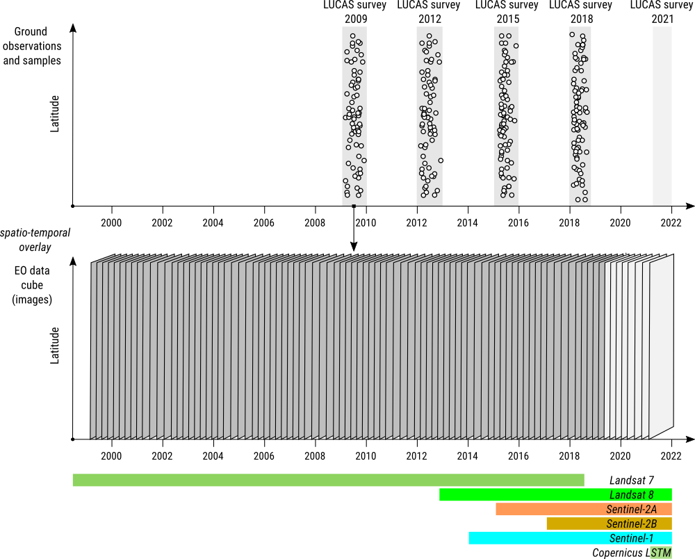

  eumap library
===========

[Community](https://opendatascience.eu) |
[Documentation](https://eumap.readthedocs.org) |
[Resources](demo/README.md) |
[Release Notes](NEWS.md)

Eumap is a library to enable easier access to several **spatial layers prepared for Continental Europe** (*Landsat and Sentinel mosaics, DTM and climate datasets, land cover, potential natural vegetation and environmental quality maps*), as well the classes and functions used to produce them. 

It implements efficient **raster access** through [rasterio](https://rasterio.readthedocs.io), different **gapfiling**, approachs **spatial and spacetime overlay**, **training samples** preparation (LUCAS points), and **Ensemble Machine Learning** applied to spatial predictions (fully compatible with [scikit-learn](https://scikit-learn.org)).

pyeumap Workflow 
-------

The workflow implemented by pyeumap 1) fills all the gaps for different remote sensing time-series, 2) does the space time overlay of point samples on several raster layers according to the reference date, 3) trains and evaluate a machine learning model, and 4) does the space time predictions for a specific target variable. These processing steps are [demonstrated ](demo/python) using a [benchmark dataset for land-cover classification](http://doi.org/10.5281/zenodo.4058447) in different areas of the EU

This image presents the output of the gap filing approach for an area located in Croatia (tile 9529). This image refers to a Landsat temporal composites for the 2010 fall season, however all the 4 seasons since 2000 were analysed to fill the gaps.

This animation shows the land-cover classes for an area located in Sweden (tile 22497) according to the space time predictions. This example is a small use case that used 680 point samples, obtained in different years, to train a single model and to predict the land-cover in the region over the time.

Spatiotemporal Machine-Learning
-------------------------------
In the Geo-harmonizer project, we prepare Analysis-Ready Earth Observation images from Landsat and 
Sentinel missions, then use ground observations from the European Commission projects such as [LUCAS surveys](https://land.copernicus.eu/imagery-in-situ/lucas) and CORINE and similar to 
overlay the ground observations in the spacetime cubes. From this data we create spatiotemporal regression and classification matrices (see: [sample data set](https://doi.org/10.5281/zenodo.4058447)). The eumap package (python and R versions) will allow accessing this data and testing models that apply Machine Learning for predictive mapping in spacetime.

License
-------
© Contributors, 2020. Licensed under an [Apache-2](https://gitlab.com/geoharmonizer_inea/eumap/blob/master/LICENSE) license.

Contribute to eumap
---------------------
eumap has been developed and used by a group of active community members. Your help is very valuable to make the package better for everyone. Refer to the [Community Page](https://opendatascience.eu).

Reference
---------
- _Publication is pending_
- eumap is one of the deliverables of the GeoHarmonizer INEA project.

Funding
--------
This work has received funding from the European Union's the Innovation and Networks Executive Agency (INEA) under Grant Agreement [Connecting Europe Facility (CEF) Telecom project 2018-EU-IA-0095](https://ec.europa.eu/inea/en/connecting-europe-facility/cef-telecom/2018-eu-ia-0095).

