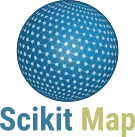
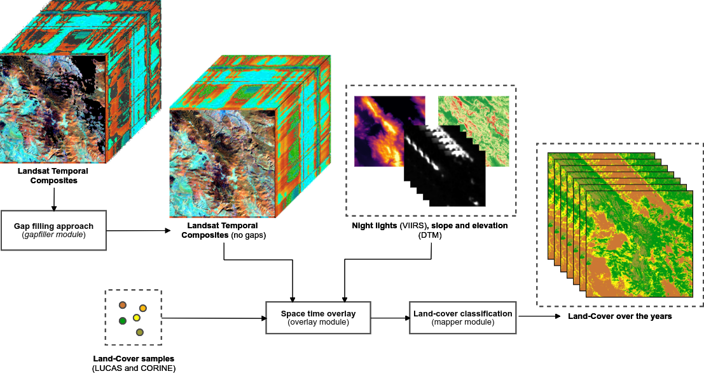

===========
[](./LICENSE)

<!--- Add small benchmark dataset in zenodo
[](http://doi.org/10.5281/zenodo.4058447)
-->
<!---
[Community](https://opendatascience.eu) |
[Documentation](https://eumap.readthedocs.org) |
[Resources](demo/README.md) |
[Release Notes](NEWS.md)
-->

`scikit-map` is a Python module to produce maps using machine learning, reference samples and raster data. It is fully compatible with [scikit-learn](https://github.com/scikit-learn/scikit-learn) and distributed under the MIT license. 

The project was started in 2020 by [GeoHarmonizer](https://opendatascience.eu/geoharmonizer-project/) and originally called [`eumap`](https://gitlab.com/geoharmonizer_inea/eumap). In 2023, `eumap` was archived and the codebase moved to this repository.

Main functionalities
-------



`scikit-map` implements:
- Parallel raster reading and writing 
- Spatial and time-series gapfilling
- Space and spacetime overlay 
- ML training, evaluation and spatial prediction
- Parallel tilling processing 

Installation
-------

**Dependencies**

`scikit-map` requires:

- Python (>= 3.7)
- Scikit-learn(>= 1.0)
- NumPy (>= 1.19)
- Rasterio (>= 1.1)
- Pandas (>= 2.0)
- Geopandas (>= 0.13)
- joblib (>= 1.1.1)

If you already have a working installation of `gdal`, `scikit-learn` and `numpy`, you can install `scikit-map` is using pip:

```bash
pip install -e 'git+https://github.com/scikit-map/scikit-map#egg=scikit-map[full]'
```

License
-------
© Contributors, 2023. Licensed under an [MIT License](LICENSE).

Contributing
---------------------
To learn more about making a contribution to scikit-learn, please see our [Contributing guide](CONTRIBUTING.md).

Acknowledgements & Funding
--------

This work is supported by [OpenGeoHub Foundation](https://opengeohub.org/) and [MultiOne](https://multione.hr/) and has received funding from European Comission (EC) through the projects:

- [AI4SoilHealth](https://ai4soilhealth.eu/): Accelerating collection and use of soil health information using AI technology to support the Soil Deal for Europe and EU Soil Observatory (1 Jan. 2023 – 31 Dec. 2026 - [101086179](https://cordis.europa.eu/project/id/101086179))
- [Open-Earth-Monitor Cyberinfrastructure](https://earthmonitor.org/): Environmental information to support EU’s Green Deal (1 Jun. 2022 – 31 May 2026 - [101059548](https://cordis.europa.eu/project/id/101059548))
- [Geo-harmonizer](https://opendatascience.eu/geoharmonizer-project/): EU-wide automated mapping system for harmonization of Open Data based on FOSS4G and Machine Learning (Sep. 2019 – Jul. 2022 -[CEF-TC-2018-5](https://hadea.ec.europa.eu/calls-proposals/2018-cef-telecom-call-public-open-data-cef-tc-2018-5_en))