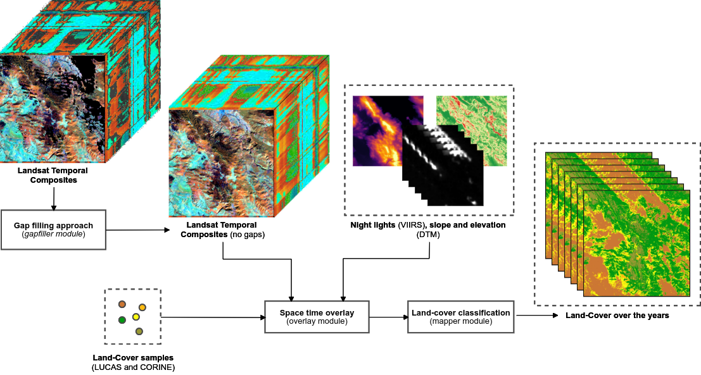

===========
[](./LICENSE)

<!--- Add small benchmark dataset in zenodo
[](http://doi.org/10.5281/zenodo.4058447)
-->
<!---
[Community](https://opendatascience.eu) |
[Documentation](https://eumap.readthedocs.org) |
[Resources](demo/README.md) |
[Release Notes](NEWS.md)
-->

`scikit-map` is a Python module to produce maps using machine learning, reference
samples and raster data. It is fully compatible with
[scikit-learn](https://github.com/openlandmap/scikit-learn) and distributed under
the MIT license.

The project was started in 2020 by
[GeoHarmonizer](https://opendatascience.eu/geoharmonizer-project/) and originally
called [`eumap`](https://gitlab.com/geoharmonizer_inea/eumap). In 2023, `eumap` was
archived and the codebase moved to this repository.

Main functionalities
-------



`scikit-map` implements:

- **Raster I/O** — parallel read/write of GeoTIFFs, lazy `RasterData` with a fluent
  filter/select API, YAML layer catalogues with `{variable}` template expansion.
- **Time-series processing** — gap filling (`SeasConvFill`), smoothing
  (`WhittakerSmooth`), yearly/seasonal aggregation (`TimeAggregate`), trend
  analysis (`TrendAnalysis`), and on-the-fly derived features (normalized
  difference, SIRCLE, percentiles, ...).
- **Space-time overlay** — sample reference points across a multi-year raster
  catalogue to build a training table, with date-based layer selection per range.
- **Spatial prediction** — run a fitted scikit-learn model over the whole grid in
  one call, appending prediction bands (labels, class probabilities, or a
  dominant-class map) to the `RasterData`.
- **Parallel tiled processing** — Ray-backed shared arrays and a pluggable compute
  backend (`numpy`, `numba`, `cpp`).

The examples below use the bundled **toy data** (`skmap.data.toy`), so they run
without downloading anything.

### Loading raster data

A layer catalogue is described in YAML and expanded into a lazy
`RasterData` via `from_yaml`. Temporal layers are grouped by year/band, static
layers under `"common"`; `{variable}` placeholders in the path template expand
over the `start_year`/`end_year` range, the `band` list and the paired
`start_month`/`end_month` lists (see `skmap.io.sources` for the schema).

```python
from skmap.data import toy
from skmap.io import RasterData

rdata = RasterData.from_yaml(str(toy.LAYERS_YAML), base_path=str(toy.DATA_DIR))

# Lazy: holds only file paths until read(). Fluent filter/select API.
rdata = (
    rdata
    .filter("variant != 'gappy'")
    .filter_date("2015-01-01", "2019-12-31", include_non_temporal=True, by_start_date=True)
    .read()
)
rdata.info          # one row per layer: group, name, start_date, end_date, band, year, ...
rdata.get_groups() # ['ndvi', 'swir1']  ("common" is excluded by get_groups)
```

A plain dict of `group -> [file paths]` works too:

```python
rdata = RasterData({
    "2020":   ["ndvi_2020.tif", "swir1_2020.tif"],
    "common": ["elev.tif", "slope.tif"],
})
```

### Time-series gap filling and smoothing

```python
from skmap.io import process

rdata = (
    RasterData.from_yaml(str(toy.LAYERS_YAML), base_path=str(toy.DATA_DIR), backend="cpp")
    .filter("band == 'ndvi' and variant == 'gappy'")
    .read()
    # Seasonal-convolution gap filling
    .run(process.SeasConvFill(season_size=4), drop_input=True)
    # Whittaker smoothing on the filled series
    .run(process.WhittakerSmooth(), group="ndvi.seasconv", drop_input=True)
    .rename(groups={"ndvi.seasconv.whittaker": "ndvi"})
    # Yearly aggregation: 50th percentile + std
    .run(process.TimeAggregate(time=[process.TimeEnum.YEARLY], operations=["p50", "std"]),
          group=["ndvi"])
)
```

`backend` is one of `"cpp"`, `"numba"`, `"numpy"`. Other runners include
`TrendAnalysis`, `NormalizedDifference`, `SircleTransformer`,
`PercentileAggregation`, `SlopeAnalysis`, `PeakAnalysis`, ...

### Space-time overlay (training data)

`SpaceTimeOverlay` samples reference points across the catalogue, selecting the
matching temporal composite for each date range plus the static layers, and
returns one row per sample with one column per layer.

```python
from sklearn.preprocessing import LabelEncoder
from skmap.overlay import SpaceTimeOverlay

samples = toy.lc_samples()                       # GeoDataFrame with a 'date' column

overlay = SpaceTimeOverlay(
    points=samples,
    col_date="date",
    rasterdata=rdata,
    date_ranges=[(f"{y}-01-01", f"{y}-12-31") for y in range(2015, 2020)],
)
train = overlay.run(max_ram_mb=512, out_file_name=None)

features = ["ndvi_winter", "ndvi_spring", "ndvi_summer", "ndvi_fall",
            "swir1_winter", "swir1_spring", "swir1_summer", "swir1_fall",
            "elev", "slope"]
le = LabelEncoder()
X, y = train[features], le.fit_transform(train["label"])
```

Derived (on-the-fly) features can be appended through a `runners` list instead of
materializing them on the `RasterData`:

```python
overlay = SpaceTimeOverlay(
    points=samples, col_date="date", rasterdata=rdata,
    runners=[process.NormalizedDifference("ndvi", "swir1")],
)
```

### Spatial prediction

`Prediction` runs a fitted scikit-learn model over the whole grid in **one model
call** for all years, appending the result as new bands under the `"prediction"`
group. `drop_input=True` drops the consumed covariates so only the predictions
remain.

```python
from sklearn.ensemble import RandomForestClassifier
from skmap.io.process import Prediction

model = RandomForestClassifier(n_estimators=100, random_state=0, n_jobs=-1).fit(X, y)

# Hard labels -> (n_years, H*W)
rdata.run(Prediction(model=model, valid_only=False), drop_input=True)
pred = rdata.array.get()

# Class probabilities + a dominant-class band (argmax over classes, NaN where invalid):
rdata.run(
    Prediction(model=model, predict_proba=True, valid_only=False,
               target_names=le.classes_.astype(str).tolist()),
    drop_input=True,
)
# band layout (out-band major): [n_class * n_years] probability bands,
#                              then [n_years] dominant-class bands
```

### Saving and plotting

```python
from skmap.io import save_rasters

# One GeoTIFF per prediction band, using a base raster for the geo-transform
out_files = [f"pred_{y}.tif" for y in rdata.get_years()]
save_rasters(rdata.base_raster, out_files, pred)

# Or write a whole group at once
rdata.to_dir("predictions/")

# Inline plots with {field} title templates
rdata.plot(cmap="RdYlGn", img_title_text="{start_date:%Y-%m-%d} — {end_date:%Y-%m-%d}")
rdata.plot(cmap=colors, img_title_text="Land cover {year} {name}")

# Animated GIF
rdata.animate(cmap="RdYlGn", img_title_text="date", to_gif="ndvi.gif", n_jobs=8)
```

See the [tutorials](docs/tutorials.rst) for the full worked examples and the
[API reference](docs/api.rst) for details.

Installation
-------

**Dependencies**

`scikit-map` requires:

- Python (>= 3.7)
- Scikit-learn(>= 1.0)
- NumPy (>= 1.19)
- Rasterio (>= 1.1)
- Pandas (>= 2.0)
- Geopandas (>= 0.13)
- joblib (>= 1.1.1)

C++ (skmap_bindings) requires:
- Eigen
- GDAL
- pybind11

Example for installation of dependencies in Ubuntu:
$ sudo sudo apt install libeigen3-dev
$ cd /usr/include
$ sudo ln -sf eigen3/Eigen Eigen
$ sudo ln -sf eigen3/unsupported unsupported
$ sudo apt install libproj-dev libgeos-dev gdal-bin libgdal-dev postgis
$ sudo apt-get install python3-pybind11

If you already have a working installation of `gdal`, `scikit-learn` and `numpy`, you can install `scikit-map` using pip:

```bash
pip install -e 'git+https://github.com/openlandmap/scikit-map#egg=scikit-map[full]'
```

License
-------
© Contributors, 2023. Licensed under an [MIT License](LICENSE).

Contributing
---------------------
To learn more about making a contribution to scikit-learn, please see our [Contributing guide](CONTRIBUTING.md).

Acknowledgements & Funding
--------

This work is supported by [OpenGeoHub Foundation](https://opengeohub.org/) and [MultiOne](https://multione.hr/) and has received funding from European Comission (EC) through the projects:

- [AI4SoilHealth](https://ai4soilhealth.eu/): Accelerating collection and use of soil health information using AI technology to support the Soil Deal for Europe and EU Soil Observatory (1 Jan. 2023 – 31 Dec. 2026 - [101086179](https://cordis.europa.eu/project/id/101086179))
- [Open-Earth-Monitor Cyberinfrastructure](https://earthmonitor.org/): Environmental information to support EU’s Green Deal (1 Jun. 2022 – 31 May 2026 - [101059548](https://cordis.europa.eu/project/id/101059548))
- [Geo-harmonizer](https://opendatascience.eu/geoharmonizer-project/): EU-wide automated mapping system for harmonization of Open Data based on FOSS4G and Machine Learning (Sep. 2019 – Jul. 2022 -[CEF-TC-2018-5](https://hadea.ec.europa.eu/calls-proposals/2018-cef-telecom-call-public-open-data-cef-tc-2018-5_en))