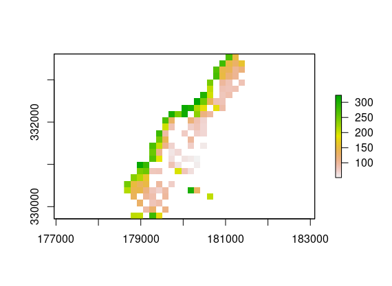

-   [Aims of demo](#aims-of-demo)
-   [train.spm](#train.spm)
-   [meuse dataset](#meuse-dataset)
-   [`train.spm()`](#train.spm-1)
-   [`predict.spm()`](#predict.spm)
-   [`accuracy.plot()`](#accuracy.plot)
-   [Basic requirements user needs to
    set](#basic-requirements-user-needs-to-set)
-   [References](#references)

Follow me on 

### Aims of demo

-   To show how to load `meuse` and `eberg` data and fit `spm` and
    generate `predictions`

### train.spm

`train.spm` sources `train.spm.fnc.R`, `predict.spm.fnc.R`, and
`accuracy.plot.spm.fnc.R` ie., for regression tasks, functions to
fulfill the aims of this tutorial using mlr3
([Lang](https://mlr3book.mlr-org.com/introduction.html#ref-mlr3) et
al. 2019)(Lang et al., [2020](#ref-MichelLang2020mlr3book)) package and
[ecosystem](https://github.com/mlr-org/mlr3/wiki/Extension-Packages).

-   In `train.spm` we need to install the required packages as
    followings:

<!-- -->

    start_time <- Sys.time()
    ls <- c("lattice", "raster", "plotKML", "ranger", "mlr3verse", "BBmisc", "knitr", "bbotk",
        "hexbin", "stringr", "magrittr", "sp", "ggplot2", "mlr3fselect", "mlr3spatiotempcv", 
        "FSelectorRcpp", "future", "future.apply", "mlr3filters", "EnvStats", "grid", "mltools","gridExtra","yardstick","plotKML", "latticeExtra","devtools")
    new.packages <- ls[!(ls %in% installed.packages()[,"Package"])]
    if(length(new.packages)) install.packages(new.packages, repos="https://cran.rstudio.com", force=TRUE)

### meuse dataset

Below setting should works with `eberg` dataset (`crs` must change to
`eberg` setting in case of SPCV resampling).

Splitting training (tr) and test (ts) sets and defining generic
variables - The user can modify them.

    smp_size <- floor(0.5 * nrow(df))
    set.seed(123)
    train_ind <- sample(seq_len(nrow(df)), size = smp_size)
    df.tr <- df[train_ind, ]
    df.ts <- df[-train_ind, ]
    folds = 5
    n_evals = 10
    colorcut. = c(0,0.01,0.03,0.07,0.15,0.25,0.5,0.75,1)
    colramp. = colorRampPalette(c("wheat2","red3"))
    xbins. = 30
    target.variable = "lead"

    library("mlr3verse")
    library("bbotk")
    library("ggplot2")
    library("mltools")
    library("data.table")
    library("mlr3fselect")
    library("FSelectorRcpp")
    library("future")
    library("future.apply")
    library("magrittr")
    library("progress")
    library("mlr3spatiotempcv")
    library("sp")
    library("landmap")  
    library("dplyr")
    library("EnvStats")
    library("grid")
    library("hexbin")
    library("BBmisc")
    library("lattice")
    library("MASS")
    library("gridExtra")
    library("MLmetrics")
    library("yardstick")
    library("plotKML")
    library("latticeExtra")
    library("devtools")

### `train.spm()`

Here we have four scenarios:

-   `classification` task with **non spatial** resampling methods
-   `regression` task with **non spatial** resampling methods
-   `classification` task with **spatial** resampling methods
-   `regression` task with **spatial** resampling methods

The above code has fitted multiple models/learners depending on the
`class()` of the **target.variable** and for now only returns a
`trained model` function so later on we could use it to train a new
dataset.

### `predict.spm()`

prediction on new dataset

### `accuracy.plot()`

Accuracy plot in case of regression task Note: don’t use it for
classification tasks for obvious reasons

### Basic requirements user needs to set

in a nutshell the user can `train` an arbitrary `s3` **(spatial) data
frame** by only defining following arguments:

`train.spm()`

-   User only **must** define a `df` and the `target.variable`.
    `train.spm()` will automatically perform `classification` or
    `regression` tasks.
-   The rest of arguments can be set or default values will be set.
-   If **crs** is set `train.spm()` will automatically take care of
    **spatial cross validation**.

<!-- -->

    train.model = train.spm(df.tr, target.variable = target.variable, folds = folds ,n_evals = n_evals, plot.workflow = TRUE, crs )

    regression Task   resampling method: non-spatialCV  ncores:  32 ...TRUE

    Using learners: method.list...TRUE

               Fitting a ensemble ML using 'mlr3::Taskregr'...TRUE

    train.model

`predict.spm()`

User needs to only set`df.ts = test set` and leave the `task = NULL`

    predict.variable = predict.spm(df.ts, task = NULL)
    predict.variable

`accuracy.plot()`

    accuracy.plot.spm(x = df.ts[,target.variable], y = predict.variable)

Accuracy plot

Accuracy plot

References
----------

Lang, M., Schratz, P., Binder, M., Pfisterer, F., Richter, J., Reich, N.
G., & Bischl, B. (2020, September 9). mlr3 book. Retrieved from
<https://mlr3book.mlr-org.com>
