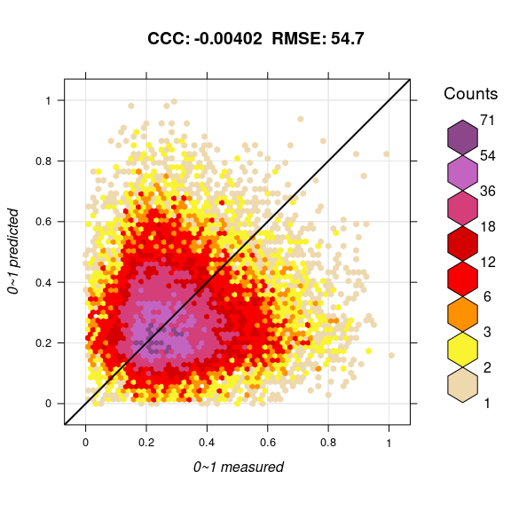

-   [meuse dataset](#meuse-dataset)
-   [Basic requirements user needs to
    set](#basic-requirements-user-needs-to-set)
-   [References](#references)

Follow me on [\[alt text\]\[1.1\]](https://twitter.com/sheykhmousa)

Package provides easier access to EU environmental maps. Basic functions
include: \* `train.spm` — train a spatial prediction model using [mlr3
package](https://mlr3.mlr-org.com/))
([Lang](https://mlr3book.mlr-org.com/introduction.html#ref-mlr3) et
al. 2019)(Lang et al., [2020](#ref-MichelLang2020mlr3book)) package and
[ecosystem](https://github.com/mlr-org/mlr3/wiki/Extension-Packages)
implementation with spatial coordinates and spatial cross-validation. In
a nutshell one can `train` an arbitrary `s3` **(spatial) data frame** in
`mlr3` ecosystem by defining following arguments:

*df* and the *target.variable*. `train.spm()` will automatically perform
`classification` or `regression` tasks and will output a `train.model`
later for prediction and also a *summary* of the model and *variable
importance*. The rest of arguments can be set or default values will be
set. If **crs** is set `train.spm()` will automatically take care of
**spatial cross validation**,

-   `predict.spm()` — prediction on a new dataset using `train.model`,

-   `accuracy.plot()` — Accuracy plot in case of regression task (don’t
    use it for classification tasks for obvious reason)

Warning: most of functions are optimized to run in parallel by default.
This might result in high RAM and CPU usage.

Spatial prediction using [Ensemble Machine
Learning](https://koalaverse.github.io/machine-learning-in-R/stacking.html#stacking-software-in-r)
with geographical distances is explained in detail in:

-   Hengl, T., MacMillan, R.A., (2019). [Predictive Soil Mapping with
    R](https://soilmapper.org/soilmapping-using-mla.html). OpenGeoHub
    foundation, Wageningen, the Netherlands, 370 pages,
    www.soilmapper.org, ISBN: 978-0-359-30635-0.
-   Hengl, T., Nussbaum, M., Wright, M. N., Heuvelink, G. B., and
    Gräler, B. (2018). [Random Forest as a generic framework for
    predictive modeling of spatial and spatio-temporal
    variables](https://doi.org/10.7717/peerj.5518). PeerJ 6:e5518.

The following examples demostrates spatial prediction using the meuse
data set:

    start_time <- Sys.time()
    ls <- c("lattice", "raster", "plotKML", "ranger", "mlr3verse", "BBmisc", "knitr", "bbotk",
        "hexbin", "stringr", "magrittr", "sp", "ggplot2", "mlr3fselect", "mlr3spatiotempcv", 
        "FSelectorRcpp", "future", "future.apply", "mlr3filters", "EnvStats", "grid", "mltools","gridExtra","yardstick","plotKML", "latticeExtra","devtools")
    new.packages <- ls[!(ls %in% installed.packages()[,"Package"])]
    if(length(new.packages)) install.packages(new.packages, repos="https://cran.rstudio.com", force=TRUE)

### meuse dataset

-   pre processing and Splitting training (tr) and test (ts) sets and
    defining generic variables.

Loading required libraries:

    library("mlr3verse")
    library("bbotk")
    library("ggplot2")
    library("mltools")
    library("data.table")
    library("mlr3fselect")
    library("FSelectorRcpp")
    library("future")
    library("future.apply")
    library("magrittr")
    library("progress")
    library("mlr3spatiotempcv")
    library("sp")
    library("landmap")  
    library("dplyr")
    library("EnvStats")
    library("grid")
    library("hexbin")
    library("BBmisc")
    library("lattice")
    library("MASS")
    library("gridExtra")
    library("MLmetrics")
    library("yardstick")
    library("plotKML")
    library("latticeExtra")
    library("devtools")
    library("raster")

`train.spm()`

Here we have four scenarios:

-   `classification` task with **non spatial** resampling methods
-   `regression` task with **non spatial** resampling methods
-   `classification` task with **spatial** resampling methods
-   `regression` task with **spatial** resampling methods

`train.spm` fits multiple models/learners depending on the `class()` of
the **target.variable** and for returns a `trained model`, **var.imp**,
**summary** of the model, and **response** variables. `trained model`
later can predict a new dataset.

`predict.spm()`

prediction on new dataset

### Basic requirements user needs to set

in a nutshell the user can `train` an arbitrary `s3` **(spatial) data
frame** by only defining following arguments:

`train.spm()`

-   User need to pass a `df`, `target.variable`. `train.spm()` will
    automatically perform `classification` or `regression` tasks.
-   The rest of arguments can be set or default values will be set.
-   If **crs** is passed `train.spm()` will automatically take care of
    **spatial cross validation**.

<!-- -->

    tr = train.spm(df.tr, target.variable = target.variable , folds = folds , n_evals = n_evals , crs)

    Regr Task   resampling method: non-spatialCV  ncores:  32 ...TRUE

    Using learners: method.list...TRUE

               Fitting a ensemble ML using 'mlr3::Taskregr'...TRUE

`train.spm` results:

    train.model= tr[[1]]
    var.imp = tr[[2]]
    var.imp

        dist        x        y    ffreq     soil 
    472304.4 248899.5 226325.8 164080.2 105424.1 

    summary = tr[[3]]
    summary

    Ranger result

    Call:
     ranger::ranger(dependent.variable.name = task$target_names, data = task$data(),      case.weights = task$weights$weight, importance = "impurity",      mtry = 2L, sample.fraction = 0.751642505638301, num.trees = 287L) 

    Type:                             Regression 
    Number of trees:                  287 
    Sample size:                      152 
    Number of independent variables:  5 
    Mtry:                             2 
    Target node size:                 5 
    Variable importance mode:         impurity 
    Splitrule:                        variance 
    OOB prediction error (MSE):       4565.397 
    R squared (OOB):                  0.631821 

    response = tr[[4]]
    response

      [1] 245.74701 198.56257 175.88260 152.64985 109.78419  89.92654 133.32049
      [8] 187.69835 152.62631  96.49871  90.27788 140.63443 230.66843 151.79353
     [15] 152.21687 244.51578 201.96843 189.52022 231.13580 196.41175 166.55726
     [22] 162.23817  78.37787  81.37886  82.09700  78.87819  79.48634  91.46878
     [29]  94.90916  78.12105  90.56540  95.71523  79.73448  80.96752  97.79402
     [36] 122.95409 226.21821 264.94612 245.52608 180.21900 138.12811 212.15112
     [43] 155.95637 113.39823 118.35871 123.89889 127.37492 155.75373 360.12410
     [50] 370.22072 358.34795 355.58192 342.90001 222.71403 251.20865 304.59883
     [57] 212.87052 262.12715 258.84917 195.99975 209.03627 200.06445 194.26583
     [64] 155.81713 234.73617 157.05111 274.29458 263.56792 260.68516 243.87849
     [71] 248.16529 246.23354 199.73629 209.53731 304.58005 269.35494 269.64654
     [78] 307.04231 281.91972 254.22778 126.47033 117.37150  93.88349 197.34422
     [85] 193.64448 155.66761 151.05174 116.01464 224.98667 231.01544  81.29955
     [92]  74.64146  75.86594  83.07239  92.53966  92.10977  80.13611  69.89051
     [99]  81.24273  72.64670  54.77423  60.35633  52.20705  52.68541  59.72386
    [106]  63.63051  57.43823  62.39574  59.22295  59.02173  74.37124 143.05840
    [113] 137.12194 108.81446 131.23716  64.76907  64.87401  90.07664 134.92331
    [120] 169.01150 227.58547 159.08946  73.86919  68.46705  67.18053 182.78634
    [127] 204.70729  50.46940  71.98755 110.08505  63.23185  58.47294  58.26195
    [134]  55.56485 113.58069 124.29915 118.72380  68.86217 108.32210 139.51111
    [141] 187.44688 107.48677 200.00631 163.21052 181.22554  99.22140 134.59688
    [148]  80.66763  87.35705 146.63598  78.32593 202.47290

`predict.spm()`

User needs to set`df.ts = test set` and pass the `train.model`.

    predict.variable = predict.spm(train.model, newdata)

`predict.spm()` results:

    predict.variable

       [1] 260.96457 260.96457 233.66716 234.80209 260.96457 233.66716 231.43072
       [8] 234.44279 264.24775 233.45740 231.43072 234.44279 204.73008 193.59737
      [15] 261.94756 234.50642 235.19164 234.37542 204.73008 191.83181 158.84201
     ...
    [3053] 161.09919 184.88595 184.87006 178.38371 180.97604 197.40706 197.99460
    [3060] 320.99734 324.49647 303.47920 299.11811 304.17845 302.91831 285.57235
    [3067] 279.93406 188.35636 186.38011 175.82721 191.11774 190.11585 189.57880
    [3074] 186.05136 187.58092 189.01147 199.36873 196.77653 320.93462 319.76563
    [3081] 322.65774 315.35383 309.38298 306.18768 295.56417 296.56473 215.20839
    [3088] 205.47790 193.43609 194.85740 210.46077 208.74149 207.14581 204.24134
    [3095] 323.49008 325.73026 322.67222 320.85128 319.77166 307.73029 221.11597
    [3102] 211.57886 209.28414

`accuracy.plot()`

Accuracy plot in case of regression task - for now we have two scenarios
including - rng = “nat” provides matrix with the real values - rng =
“norm” provides matrix with the normalized (0~1) values (don’t use it
for classification tasks for obvious reasons)

    plt = accuracy.plot.spm(x = df.tr[,target.variable], y = response, rng = "norm")

Accuracy plot

make a raster grid out of predicted variables e.g., lead (in this case)

    [1] TRUE

    class      : Extent 
    xmin       : 178460 
    xmax       : 181540 
    ymin       : 329620 
    ymax       : 333740 

grid output:

    plot(lead.r)

Raster grid

References
----------
