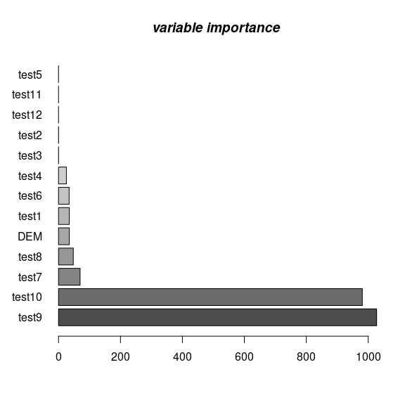
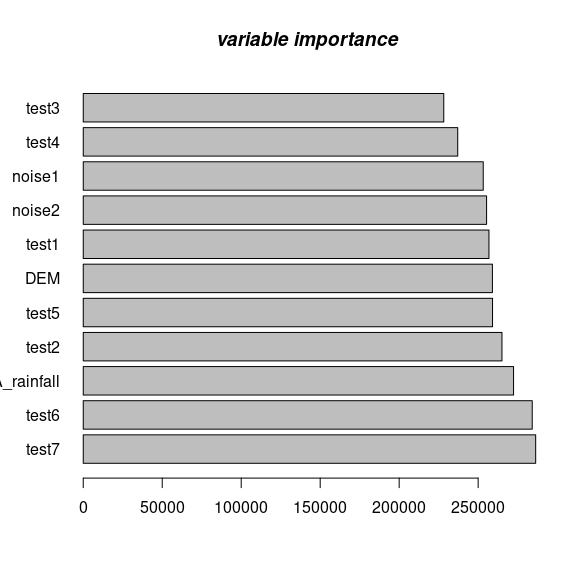
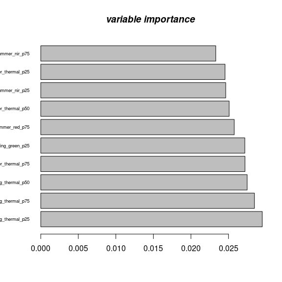
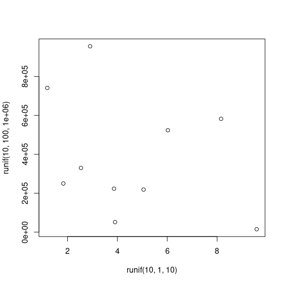

-   [Introduction](#introduction)
-   [`train_spm`](#train_spm)
-   [`predict_spm`](#predict_spm)
-   [`plot_spm`](#plot_spm)
    -   [Required packages](#required-packages)
    -   [sic97 dataset](#sic97-dataset)
    -   [spliting the data](#spliting-the-data)
    -   [Loading required libraries:](#loading-required-libraries)
    -   [`train_spm`](#train_spm-1)
    -   [`predict_spm`](#predict_spm-1)
    -   [predicted values for the *newdata*
        set:](#predicted-values-for-the-newdata-set)
    -   [`plot_spm`](#plot_spm-1)
    -   [spatial prediction on
        *rainfall*](#spatial-prediction-on-rainfall)
-   [Croatia tile](#croatia-tile)
    -   [Overlay Demonstration](#overlay-demonstration)
    -   [reading Croatia data](#reading-croatia-data)
    -   [`stripe_years`](#stripe_years)
    -   [`extract_tif`](#extract_tif)
-   [Space-Time Overlay](#space-time-overlay)
    -   [(analysis ready) data](#analysis-ready-data)
-   [`train_spm`](#train_spm-2)
-   [`predict_spm`](#predict_spm-2)
-   [References](#references)

Follow me on 

    remotes::install_git("https://gitlab.com/geoharmonizer_inea/eumap.git", subdir = 'R-package')

Introduction
------------

`eumap` aims at providing easier access to EU environmental maps. Basic
functions train a spatial prediction model using [mlr3
package](https://mlr3.mlr-org.com/), and related extensions in the [mlr3
ecosystem](https://github.com/mlr-org/mlr3/wiki/Extension-Packages)
(Casalicchio et al., [2017](#ref-casalicchio2017openml); Lang et al.,
[2020](#ref-MichelLang2020mlr3book)), which includes spatial prediction
using [Ensemble Machine
Learning](https://koalaverse.github.io/machine-learning-in-R/stacking.html#stacking-software-in-r)
taking spatial coordinates and spatial cross-validation into account. In
a nutshell one can `train` an arbitrary `s3` **(spatial)dataframe** in
`mlr3` ecosystem by defining *df* and *target.variable* i.e., response.
main functions are as the following:

`train_spm`
-----------

1.  `train_spm` will automatically perform `classification` or
    `regression` tasks and the output is a `train_model` which later can
    be used to predict `newdata`.It also provides *summary* of the model
    and *variable importance* and *response*. The rest of arguments can
    be either pass or default values will be passed. `train_spm`
    provides four scenarios:

1.1. `classification` task with **non spatial** resampling methods,

1.2. `regression` task with **non spatial** resampling methods,

1.3. `classification` task with **spatial** resampling methods,

1.4. `regression` task with **spatial** resampling methods.

`predict_spm`
-------------

1.  Prediction on a new dataset using `train_model`,
2.  User needs to set`df.ts = test set` and also pass the `train_model`.

`plot_spm`
----------

1.  Accuracy plot in case of regression task (don’t use it for
    classification tasks for obvious reason).

The following examples demonstrates spatial prediction using the
[sic97](https://wiki.52north.org/pub/AI_GEOSTATS/AI_GEOSTATSData/SIC97_description_01.pdf)
data set:

### Required packages

    start_time <- Sys.time()
    ls <- c("lattice", "raster", "plotKML", "ranger", "mlr3verse",
        "hexbin", "sp", "ggplot2", "mlr3spatiotempcv",  "rgdal",
        "FSelectorRcpp", "future", "future.apply", "mlr3filters", "grid", "mltools","gridExtra","yardstick", "latticeExtra","progressr")
    new.packages <- ls[!(ls %in% installed.packages()[,"Package"])]
    if(length(new.packages)) install.packages(new.packages, repos="https://cran.rstudio.com", force=TRUE)

### sic97 dataset

    #sic97 source data: https://rdrr.io/github/Envirometrix/landmap/man/sic1997.html
    library("landmap")  

    version: 0.0.3

    library("sp")  
    data(sic1997) 
    sic97 <- na.omit(sic1997)
    sic97 <- sic1997$swiss1km[c("CHELSA_rainfall","DEM")]
    df <- data.frame(sic97)
    # adding covariats i.e, principal component. (from landmap package https://github.com/Envirometrix/landmap)
    sp.df <- df
    coordinates(sp.df) <- ~x+y
    proj4string(sp.df) <- CRS("+init=epsg:28992")
    gridded(sp.df) = TRUE
    pc <- spc(sp.df)

    Converting covariates to principal components...

    df$pc1 <- pc@predicted$PC1
    df$pc2 <- pc@predicted$PC2
    #let's create some fake cov
    df$test1 <- log10(df$DEM)*53.656
    df$test2 <- cos(df$DEM)*-0.13
    df$test3 <- sin(df$DEM)**31
    df$test11 <- runif(1:nrow(df))/0.54545
    df$test12 <- sqrt(runif(1:nrow(df)))

### spliting the data

    smp_size <- floor(0.5 * nrow(df))
    set.seed(123)
    train_ind <- sample(seq_len(nrow(df)), size = smp_size)
    df.tr <- df[train_ind,]
    df.ts <- df[-train_ind, ]
    newdata = df.ts

### Loading required libraries:

    library("mlr3verse")#
    library("mlr3spatiotempcv")#
    library("grid")#
    library("hexbin")#
    library("BBmisc")#
    library("lattice")#
    library("gridExtra")#
    library("MLmetrics")
    library("yardstick")#
    library("latticeExtra")#
    library("eumap")
    library("ppcor")
    library("progressr")
    library("checkmate")
    library("future")

### `train_spm`

`train_spm` fits multiple models/learners depending on the `class` of
the **target.variable** and returns a `trained model`, **variable
importance**, **summary** of the model, and **response** variables.
`trained model` later can predict a `newdata` set.

    tr = eumap::train_spm(df.tr, target.variable = "CHELSA_rainfall", folds = 5, n_evals = 3, crs = "+init=epsg:4326")

            Regression Task  ...TRUE

               Fitting an ensemble ML using  kknn  featureless, and Randome Forests models ncores: 32  resampling method: (spatial)repeated_cv by cooridinates ...TRUE

-   1st element contains the *trained model*,
-   2nd element contains the *variable importance*,
-   3rd element contains a summary of the *trained model*,
-   4th element contains the *predicted values* of our trained model,
-   5th element contains the ranking of the *important variables*.

<!-- -->

    train_model= tr[[1]]
    var.imp = tr[[2]]
    summary = tr[[3]]
    response = tr[[4]]
    vlp = tr[[5]]
    target = tr[[6]]

### `predict_spm`

prediction on *newdata* set

    predict.variable = eumap::predict_spm(train_model, newdata)

### predicted values for the *newdata* set:

    predict.variable = predict_spm(train_model, df.ts)
    pred.v = predict.variable[[1]]
    valu.imp= predict.variable[[2]]
    pred.v

    ...
        [1]  70.17253  72.26383  71.71920  82.21987  69.13120  71.56263  72.56500
        [8]  74.98890  84.10737  93.17867  99.90727  75.95213  67.04603  71.37333
       [15]  73.51697  90.37813  95.94743  76.48633  85.44157  80.36723  88.15520
       [22]  88.28993  87.08397 107.97190  87.98777  79.19460  72.44463  67.97330
       [29]  92.11600  72.66763  78.68553  88.09083 106.60293  82.08747  71.86700
       [36]  71.41057  95.89593  90.87327  84.32587  76.58570  75.92003  76.08717
       [43]  85.82523  92.98017  68.69223  79.67920  89.21633 100.92760 105.03510
       [50]  83.02513  88.51497  82.22827  69.98717  73.52420  84.95930  67.32343
       [57] 102.54480  96.20317  87.02367  86.89320  85.14670  86.29223  78.33800
       [64]  74.31377  77.04393  77.97673  79.93243  89.90213  75.99757  79.06483
    ...

    #valu.imp

### `plot_spm`

-   Variable importance

<!-- -->

    plt = plot_spm(df, gmode  = "norm" , gtype = "var.imp")

var.imp

-   Accuracy plot

<!-- -->

    plt = plot_spm(df, gmode  = "norm" , gtype = "accuracy")

Accuracy plot

### spatial prediction on *rainfall*

    predict.variable = predict_spm(train_model, df)
    df$rainP = predict.variable[[1]]
    coordinates(df) <- ~x+y
    proj4string(df) <- CRS("+init=epsg:28992")
    # creat raster out of output
    gridded(df) = TRUE

make a map using ensemble machine learning with spatial cross validation
for the predicted variables e.g., *rainfall* (in this case).

    plot(df[,"rainP"])

Raster grid

Croatia tile
------------

### Overlay Demonstration

we will use the eumap package to overlay all the points of a vector
layer (geopackage file) on several raster layers (geotiff files), using
the SpaceOverlay and SpaceTimeOverlay classes to handle with timeless
and temporal layers, respectively. In our dataset the elevation and
slope, based on digital terrain model, are timeless and the landsat
composites (7 spectral bands, 4 seasons and 3 percentiles) and night
light (VIIRS Night Band) layers are temporal (from 2000 to 2020).

### reading Croatia data

Our dataset refers to 1 tile, located in Croatia, extracted from a
tiling system created for European Union (7,042 tiles) by [GeoHarmonizer
Project](https://opendatascience.eu/).

    library(rgdal)

    rgdal: version: 1.5-18, (SVN revision 1082)
    Geospatial Data Abstraction Library extensions to R successfully loaded
    Loaded GDAL runtime: GDAL 3.1.3, released 2020/09/01
    Path to GDAL shared files: /usr/share/gdal
    GDAL binary built with GEOS: TRUE 
    Loaded PROJ runtime: Rel. 4.8.0, 6 March 2012, [PJ_VERSION: 480]
    Path to PROJ shared files: (autodetected)
    Linking to sp version:1.4-4

    tif1.lst = list.files("/data/eumap/sample-data/R-sample-tiles/9529", pattern=".tif", full.names=TRUE, recursive=TRUE) 
    df = readOGR("/data/eumap/sample-data/R-sample-tiles/9529_croatia_landcover_samples.gpkg")

    OGR data source with driver: GPKG 
    Source: "/data/eumap/sample-data/R-sample-tiles/9529_croatia_landcover_samples.gpkg", layer: "9529_croatia_landcover_samples"
    with 759 features
    It has 5 fields

    df <- as.data.frame(df)
    df$Date = format.Date(as.Date(paste(df$survey_date), format="%Y/%m/%d"), "%Y-%m-%d")
    df$row.id = 1:nrow(df)

### `stripe_years`

-   strips the file names of the \*.tif list file to specific years from
    2000 to 2020

<!-- -->

    begin.tif1.lst = sapply(tif1.lst, function(i){strip_years(i, type="begin")})
    end.tif1.lst = sapply(tif1.lst, function(i){strip_years(i, type="end")})
    unique(end.tif1.lst)

     [1] "2000-12-31" "2001-12-31" "2002-12-31" "2003-12-31" "2004-12-31"
     [6] "2005-12-31" "2006-12-31" "2007-12-31" "2008-12-31" "2009-12-31"
    [11] "2010-12-31" "2011-12-31" "2012-12-31" "2013-12-31" "2014-12-31"
    [16] "2015-12-31" "2016-12-31" "2017-12-31" "2018-12-31" "2019-12-31"
    [21] "2020-12-31"

### `extract_tif`

-   spatio-temporal overlay of data points and \*.tif data.

<!-- -->

    cores = ifelse(parallel::detectCores()<length(tif1.lst), parallel::detectCores(), length(tif1.lst))
    ov.pnts <- parallel::mclapply(1:length(tif1.lst), function(i){ eumap::extract_tif(tif=tif1.lst[i], df, date="Date", date.tif.begin=begin.tif1.lst[i], date.tif.end=end.tif1.lst[i], coords=c("coords.x1","coords.x2")) }, mc.cores=cores)
    gc()

               used  (Mb) gc trigger  (Mb) max used  (Mb)
    Ncells  4130993 220.7    6158240 328.9  6158240 328.9
    Vcells 33676812 257.0   53119176 405.3 44197695 337.3

    ov.pnts = ov.pnts[!sapply(ov.pnts, is.null)]

-   Structure of the Top 3 row of the data points.

<!-- -->

    str(ov.pnts[1:3])

    List of 3
     $ :'data.frame':   180 obs. of  2 variables:
      ..$ landsat_ard_fall_blue_p25: num [1:180] 4 6 4 6 6 4 6 6 4 8 ...
      ..$ row.id                   : int [1:180] 3 4 7 15 18 20 26 28 32 36 ...
     $ :'data.frame':   180 obs. of  2 variables:
      ..$ landsat_ard_fall_blue_p50: num [1:180] 4 6 4 7 7 5 7 6 4 8 ...
      ..$ row.id                   : int [1:180] 3 4 7 15 18 20 26 28 32 36 ...
     $ :'data.frame':   180 obs. of  2 variables:
      ..$ landsat_ard_fall_blue_p75: num [1:180] 4 7 5 7 7 6 8 6 5 9 ...
      ..$ row.id                   : int [1:180] 3 4 7 15 18 20 26 28 32 36 ...

Space-Time Overlay
------------------

For the temporal layers, the points should be filtered by year and
overlayed on the right raster files. The SpaceTimeOverlay class
implements this approach using the parameter: - timeless\_data: The
result of SpaceOverlay (GeoPandas DataFrame) - col\_date: The column
that contains the date information (2018-09-13) - dir\_temporal\_layers:
The directory where the temporal raster files are stored, organized by
year.

    library(data.table)
    commcols <- Reduce(intersect, lapply(ov.pnts, names))
    L.dt <- lapply(ov.pnts, function(x) setkeyv(data.table(x), commcols))
    cmt <- do.call(cbind, L.dt) 
    uq.lst <- unique(colnames(cmt))
    cm.tif <- cmt[, .SD, .SDcols = unique(names(cmt))]
    df <- as.data.table(df)
    cm <- Reduce(merge,list(df,cm.tif))
    tt = cbind(cm,df$year)
    #saveRDS(tt, "/data/eumap/sample-data/R-sample-tiles/9529/9529_croatia_samples.rds")

-   To partially demonstrate the structure of the data:

<!-- -->

    str(tt)

    ...
    Classes 'data.table' and 'data.frame':  759 obs. of  96 variables:
     $ row.id                        : int  3 3 3 3 3 4 4 4 4 4 ...
     $ lucas                         : int  0 0 0 0 0 0 0 0 0 0 ...
     $ survey_date                   : chr  "2000/06/30" "2000/06/30" "2000/06/30" "2000/06/30" ...
     $ lc_class                      : int  324 324 324 324 324 321 321 321 321 321 ...
     $ tile_id                       : int  9529 9529 9529 9529 9529 9529 9529 9529 9529 9529 ...
     $ confidence                    : num  85 85 85 85 85 85 85 85 85 85 ...
     $ coords.x1                     : num  4770204 4770204 4770204 4770204 4770204 ...
     $ coords.x2                     : num  2414683 2414683 2414683 2414683 2414683 ...
     $ Date                          : chr  "2000-06-30" "2000-06-30" "2000-06-30" "2000-06-30" ...
    ...

### (analysis ready) data

    library(dplyr)
    cm.croatia <- readRDS("/data/eumap/sample-data/R-sample-tiles/9529/9529_croatia_samples.rds")
    df <-  cm.croatia
    df$lc_class <- as.factor(df$lc_class)
    df <- df %>% group_by_if(is.character, as.factor)
    df$row.id <- NULL
    df$survey_date <- NULL
    df$lucas <- NULL
    df$Date <- NULL
    df$id <- NULL
    df$year <- NULL
    df$tile_id <- NULL
    df$confidence <- NULL
    colnames(df)[2] <- "x"
    colnames(df)[3] <- "y"
    #coordinate_names = c("x","y")
    df <- as.data.frame(df)
    smp_size <- floor(0.5 * nrow(df))
    set.seed(123)
    train_ind <- sample(seq_len(nrow(df)), size = smp_size)
    df.tr <- df[train_ind, ]
    df.ts <- df[ -train_ind,]
    newdata = df.ts

`train_spm`
-----------

    library(mlr3verse)
    library(future)
    library(progressr)
    library(checkmate)
    tr = eumap::train_spm(df.tr, target.variable = "lc_class" , folds = 5 , n_evals = 3)

            classification Task  ...TRUE

               Fitting an ensemble ML using  kknn  featureless, and Randome Forests models ncores: 32  resampling method: (non-spatial) repeated_cv ...TRUE

-   storing values of *tr* for further use.

<!-- -->

    train_model= tr[[1]]
    var.imp = tr[[2]]
    summary = tr[[3]]
    response = tr[[4]]
    vlp = tr[[5]]
    target = tr[[6]]
    summary

    Ranger result

    Call:
     ranger::ranger(dependent.variable.name = task$target_names, data = task$data(),      probability = self$predict_type == "prob", case.weights = task$weights$weight,      importance = "permutation", mtry = 2L, sample.fraction = 0.964161029900424,      num.trees = 215L) 

    Type:                             Classification 
    Number of trees:                  215 
    Sample size:                      379 
    Number of independent variables:  89 
    Mtry:                             2 
    Target node size:                 1 
    Variable importance mode:         permutation 
    Splitrule:                        gini 
    OOB prediction error:             2.11 % 

-   variable importance plot; (shows only 10% of important variables)

<!-- -->

    varImp = barplot(var.imp[1:(round(length(var.imp)*0.1)+1)], horiz = TRUE, las = 1,cex.names = 0.7)
      title(main = "variable importance", font.main = 4)

Accuracy plot

`predict_spm`
-------------

Prediction; raster map

    year.span = c(2000:2020)
    #
    aq =c("/data/eumap/sample-data/R-sample-tiles/9529/timeless/dtm_elevation.tif" ,"/data/eumap/sample-data/R-sample-tiles/9529/timeless/dtm_slope.tif")
    for (i in 1:2) {
      tif1.lst = list.files(paste0('/data/eumap/sample-data/R-sample-tiles/9529/',year.span[i]), pattern=".tif", full.names=TRUE, recursive=TRUE)
      tif1.lst <- append(tif1.lst, aq)
      out.tif <- paste0("/data/eumap/img/R/","land_cover_9529_croatia_",year.span[i],".tif")
      br01 = stack(tif1.lst)
      newdata = as(br01, "SpatialGridDataFrame")
      predict.ts = predict_spm(train_model, newdata@data)
      newdata$pred = predict.ts
      newdataa <- newdata ## copy and make new raster object
      newdataa@data$pred <- as.numeric(levels(newdataa@data$pred))[newdataa@data$pred]
      #writeGDAL(newdataa["pred"], out.tif, drivername="GTiff", type="Int16", mvFlag = -32768 ,options=c("COMPRESS=DEFLATE"))
    }

-   Removing small classes in prediction (*optional*)

<!-- -->

    xg <- summary(newdata$pred, maxsum=(1+length(levels(newdata$pred))))
    str(xg)
    selg.levs <- attr(xg, "names")[xg > 5]  
    attr(xg, "names")[xg <= 5] #drop classes with less than 5 pixels
    newdata$pred[which(!newdata$pred %in% selg.levs)] <- NA
    newdata$pred <- droplevels(newdata$pred)
    str(summary(newdata$pred, maxsum=length(levels(newdata$pred))))

    plot(x=10,y=100)

LC map

References
----------

Casalicchio, G., Bossek, J., Lang, M., Kirchhoff, D., Kerschke, P.,
Hofner, B., … Bischl, B. (2017). OpenML: An R package to connect to the
machine learning platform OpenML. *Computational Statistics*, 1–15.
doi:[10.1007/s00180-017-0742-2](https://doi.org/10.1007/s00180-017-0742-2)

Lang, M., Schratz, P., Binder, M., Pfisterer, F., Richter, J., Reich, N.
G., & Bischl, B. (2020, September 9). mlr3 book. Retrieved from
<https://mlr3book.mlr-org.com>
