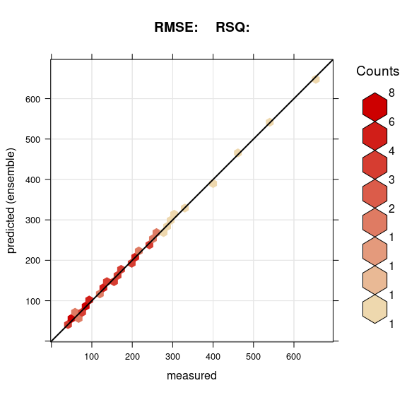

# eumap package for R

Follow me on [](https://twitter.com/sheykhmousa)

Package provides easier access to EU environmental maps.
Basic functions include:

* `train.spm` --- train a spatial prediction model using [mlr3 package](https://mlr3.mlr-org.com/)) ([Lang](https://mlr3book.mlr-org.com/introduction.html#ref-mlr3) et
al. 2019)(Lang et al., [2020](#ref-MichelLang2020mlr3book)) package and
[ecosystem](https://github.com/mlr-org/mlr3/wiki/Extension-Packages) implementation with spatial coordinates and spatial cross-validation. In a nutshell one can `train` an arbitrary `s3` **(spatial) data
frame** in `mlr3` ecosystem by defining following arguments:

*df* and the *target.variable*.
    `train.spm()` will automatically perform `classification` or
    `regression` tasks and will output a `train.model` later for prediction and also a *summary* of the model and *variable importance*.
The rest of arguments can be set or default values will be set.
If **crs** is set `train.spm()` will automatically take care of
    **spatial cross validation**,

* `predict.spm()` --- prediction on a new dataset using `train.model`,

* `accuracy.plot()` --- Accuracy plot in case of regression task (don’t use it for classification tasks for obvious reason)


Warning: most of functions are optimized to run in parallel by default. This might result in high RAM and CPU usage.

Spatial prediction using [Ensemble Machine Learning](https://koalaverse.github.io/machine-learning-in-R/stacking.html#stacking-software-in-r) with geographical distances 
is explained in detail in:

- Hengl, T., MacMillan, R.A., (2019). 
   [Predictive Soil Mapping with R](https://soilmapper.org/soilmapping-using-mla.html). 
   OpenGeoHub foundation, Wageningen, the Netherlands, 370 pages, www.soilmapper.org, 
   ISBN: 978-0-359-30635-0.
- Hengl, T., Nussbaum, M., Wright, M. N., Heuvelink, G. B., and Gräler, B. (2018). 
   [Random Forest as a generic framework for predictive modeling of spatial and spatio-temporal variables](https://doi.org/10.7717/peerj.5518). PeerJ 6:e5518.

The following examples demostrates spatial prediction using the meuse data set:

```r
ls <- c("mlr3verse","sp", "raster", "yardstick", "hexbin", 
        "mlr3spatiotempcv", "mlr3fselect", "FSelectorRcpp", "bbotk")
new.packages <- ls[!(ls %in% installed.packages()[,"Package"])]
if(length(new.packages)) install.packages(new.packages)
library("ggplot2")
library("mltools")
library("data.table")
library("future")
library("future.apply")
library("magrittr")
library("dplyr")
library("EnvStats")
library("grid")
library("BBmisc")
library("lattice")
library("MASS")
library("gridExtra")
library("MLmetrics")
library("latticeExtra")
library("devtools")
library("landmap")
demo(meuse, echo=FALSE)
target.variable = "lead"
```

<!-- -->

    train.model = train.spm(df.tr, target.variable = target.variable, folds = folds ,n_evals = n_evals, plot.workflow = TRUE, crs )

    regression Task   resampling method: non-spatialCV  ncores:  32 ...TRUE

    Using learners: method.list...TRUE

               Fitting a ensemble ML using 'mlr3::Taskregr'...TRUE

    train.model
    > var.imp
                        copper      cadmium         elev       dist.m         zinc         soil         dist         lead           om 
                  0.0270375435 0.0260349549 0.0196909307 0.0153951701 0.0141349411 0.0118281616 0.0088289879 0.0066457337 0.0046673471 
                          lime        ffreq 
                  0.0043261842 0.0004014055 
    > summary
    Type:                             Classification 
      Number of trees:                  500 
      Sample size:                      76 
      Number of independent variables:  11 
      Mtry:                             3 
      Target node size:                 1 
      Variable importance mode:         permutation 
      Splitrule:                        gini 
      OOB prediction error:             64.47 % 

`predict.spm()`

User needs to set`df.ts = test set` and `task = NULL` and pass the `train.model`.

    predict.variable = predict.spm(df.ts, task = NULL, train.model)
    predict.variable

`accuracy.plot()`

    accuracy.plot.spm(x = df.ts[,target.variable], y = predict.variable)


<p class="caption">

</p>

## Contributions

* Contributions to eumap are welcome. Issues and pull requests are the preferred ways of sharing them.
* We are interested in your results and experiences with using the mlr3 functions 
  for generating spatial predictions with your own data. Share your data sets, 
  code and results either using github issues and/or R-sig-geo mailing list.

References
----------

Lang, M., Schratz, P., Binder, M., Pfisterer, F., Richter, J., Reich, N.
G., & Bischl, B. (2020, September 9). mlr3 book. Retrieved from
<https://mlr3book.mlr-org.com>
