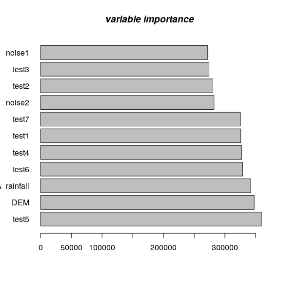
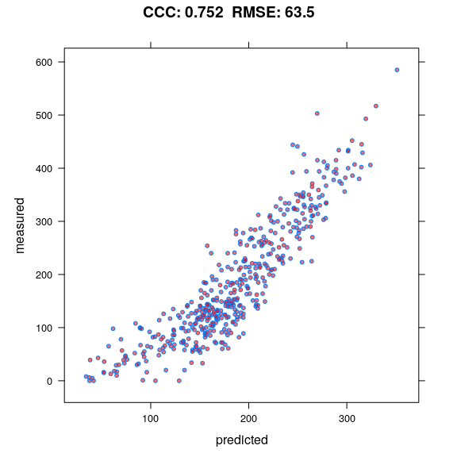
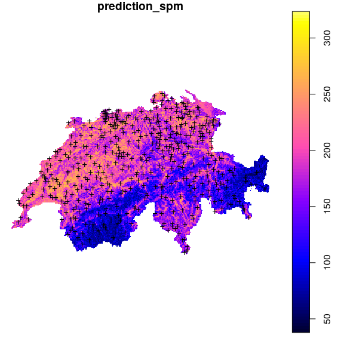

Tutorial on Automated Spatial Modeling, Prediction and Visualizations
================
Mohammadreza Sheykhmousa
(<a href="mailto:mohammadreza.sheykhmousa@OpenGeoHub.org" class="email">mohammadreza.sheykhmousa@OpenGeoHub.org</a>)
and Tom Hengl
(<a href="mailto:tom.hengl@OpenGeoHub.org" class="email">tom.hengl@OpenGeoHub.org</a>)
Last compiled on: 29 January, 2021

-   [Starting eumap package](#starting-eumap-package)
-   [Installing eumap](#installing-eumap)
-   [Introduction](#introduction)
-   [`train_spm`](#train_spm)
-   [`predict_spm`](#predict_spm)
-   [`plot_spm`](#plot_spm)
-   [Required packages](#required-packages)
-   [sic1997: The SIC 1997 Data Set](#sic1997-the-sic-1997-data-set)
-   [`train_spm`](#train_spm-1)
-   [`predict_spm`](#predict_spm-1)
-   [`plot_spm`](#plot_spm-1)
    -   [spatial prediction on
        *rainfall*](#spatial-prediction-on-rainfall)
-   [References](#references)

This work is licensed under a [Creative Commons Attribution-ShareAlike
4.0 International
License](http://creativecommons.org/licenses/by-sa/4.0/).

Follow me on 

Part of: [eumap package](https://gitlab.com/geoharmonizer_inea/eumap/)  
Project: [Geo-harmonizer](https://opendatascience.eu)  
Last update: 2021-01-29

Starting eumap package
----------------------

Installing eumap
----------------

To install the most up-to-date version of eumap please use:

    remotes::install_git("https://gitlab.com/geoharmonizer_inea/eumap.git", subdir = 'R-package')

Introduction
------------

`eumap` package aims at providing easier access to EU environmental
maps. Basic functions train a spatial prediction model using [mlr3
package](https://mlr3.mlr-org.com/), (Lang et al., [2019](#ref-mlr3)),
and related extensions in the [mlr3
ecosystem](https://github.com/mlr-org/mlr3/wiki/Extension-Packages)
(Casalicchio et al., [2017](#ref-casalicchio2017openml); Lang et al.,
[2020](#ref-MichelLang2020mlr3book)), which includes spatial prediction
using [Ensemble Machine
Learning](https://koalaverse.github.io/machine-learning-in-R/stacking.html#stacking-software-in-r),
taking spatial coordinates and spatial cross-validation into account. In
a nutshell one can `train` an arbitrary `s3` **(spatial)dataframe** in
`mlr3` ecosystem by defining *df* and *target.variable* i.e., response.
To learn more about the [mlr3 ecosystem](https://mlr3.mlr-org.com/) best
refer to the mlr3 book by Becker et al. (Lang et al.,
[2020](#ref-MichelLang2020mlr3book)).

The main functions in eumap are as following:

`train_spm`
-----------

1.  `train_spm` will automatically perform `classification` or
    `regression` tasks and the output is a `train_model` which later can
    be used to predict `newdata`.It also provides *summary* of the model
    and *variable importance* and *response*. The rest of arguments can
    be either pass or default values will be passed. `train_spm`
    provides four scenarios:

1.1. `classification` task with **non spatial** resampling methods, 1.2.
`regression` task with **non spatial** resampling methods, 1.3.
`classification` task with **spatial** resampling methods, 1.4.
`regression` task with **spatial** resampling methods,

`predict_spm`
-------------

Here two arguments are important:

1.  `object` used to generate prediction on a new dataset,
2.  `newdata` user needs to set new observations which should be
    predicted,

`plot_spm`
----------

Here two scenarios are possible:

1.  Accuracy plot predicted vs observed in case of regression task,
2.  Confusion matrix predicted vs observed in the case of classification
    task,

**Warning:** some functions are optimized to run in parallel by default.
This might result in high RAM and CPU usage.

The following examples demonstrates spatial prediction using the `sic97`
data set:

Required packages
-----------------

    ls <- c(
       "lattice", "mlr3verse", "BBmisc", "devtools", 
       "hexbin", "sp", "mlr3spatiotempcv", 'MLmetrics',
       "FSelectorRcpp", "future", "future.apply", "grid",
       "gridExtra", "yardstick", "latticeExtra", "bbotk", "bbotk"
       )
    new.packages <- ls[!(ls %in% installed.packages()[,"Package"])]

    if (length(new.packages)) install.packages(new.packages, repos = "https://cran.rstudio.com", force = TRUE)

    # core libraries###
    library(eumap)
    library(mlr3verse)
    library(mlr3tuning)
    library(mlr3spatiotempcv)
    library(future)
    library(checkmate)

    # graphical libraries###
    library(likert)
    library(cvms)
    library(broom)    
    library(tibble)   
    library(ggimage)   
    library(rsvg)   
    library(grid)
    library(hexbin)
    library(BBmisc)
    library(lattice)
    library(gridExtra)
    library(latticeExtra)

    # mathematical and geospatial libraries###
    library(sp)
    library(caret)
    library(MLmetrics)
    library(yardstick)
    library(ppcor)
    library(scales)
    library(bbotk)

sic1997: The SIC 1997 Data Set
------------------------------

For demonstration we are using daily rainfall dataset from Switzerland
used in the Spatial Interpolation Comparison 1997. For more information
about the data set please see
[HERE](https://rdrr.io/github/Envirometrix/landmap/man/sic1997.html).

    library(devtools)

    Loading required package: usethis

    #install_github("envirometrix/landmap")
    library(landmap)

    version: 0.0.8

    Attaching package: 'landmap'

    The following object is masked from 'package:mlr3spatiotempcv':

        cookfarm

    data("sic1997")
    df = cbind(as.data.frame(sic1997$daily.rainfall), 
                       as.data.frame(sp::over(sic1997$daily.rainfall, sic1997$swiss1km)))
    df.tr <- na.omit(df)

Note that here we use whole the data to test and train the model, as the
dataset is not large enough (i.e., only 456 observations). In the
training part, however, there will be internal sampling that will
provide the Out Of Bag sampling and OOB R-square (Sheykhmousa et al.,
[2020](#ref-sheykhmousa2020support)).

We can create some synthetic covariates, so we can demonstrate that (a)
the learner is noise-proof, and (b) that this is visible in the variable
importance plots:

    target.variable = "rainfall"
    df.tr$test1 <- log10(df.tr$DEM)*53.656
    df.tr$test2 <- cos(df.tr$DEM)*-0.13
    df.tr$test3 <- sin(df.tr$DEM)**31
    df.tr$test4 <- (df.tr$DEM)**-5.13
    df.tr$test5 <- (df.tr$DEM/2**4)**6
    df.tr$test6 <- (df.tr$CHELSA_rainfall)**-1
    df.tr$test7 <- ((df.tr$CHELSA_rainfall)*13/34)
    df.tr$noise1 <- runif(1:nrow(df.tr))/0.54545
    df.tr$noise2 <- sqrt(runif(1:nrow(df.tr)))
    df.tr$border <- NULL
    df.tr$X <- NULL
    df.tr$Y <- NULL

where *noise1* and *noise2* are pure noises. Note that we shouldn’t use
non-numeric covariates in `train_spm` for regression tasks; in this case
*border*. X and Y also removed to avoid bias in training the model.

`train_spm`
-----------

`train_spm` fits multiple models/learners (depending on the *class* of
the **target.variable**) and automatically tune all the underlying
hyperparameters using `AutoTuner` powered by
[mlr3](https://mlr3book.mlr-org.com/pipe-nonlinear.html) and returns a
`trained model`, **var.imp**, **summary** of the model, and **response**
variables. `trained model` later can predict a `newdata` set.

    tr = eumap::train_spm(df.tr, target.variable = "rainfall", folds = 3, n_evals = 5)

    Fitting an ensemble ML using kknn featureless, and ranger models ncores: 32 TRUE

    Regression Task....TRUE

    Using resampling method: (non-spatial) repeated_cv...TRUE

`train_spm` results:

1st element is the *trained model*:

    train_model = tr[[1]]

2nd element is the *variable importance*:

    Vim = tr[[2]]

3rd element is the summary of the *trained model*. Note that the *R
squared (OOB)* shows performance evaluation of the model during training
in which sample fraction for different batches varies from 50% to 70%.

    tr[[3]]

    Ranger result

    Call:
     ranger::ranger(dependent.variable.name = task$target_names, data = task$data(),      case.weights = task$weights$weight, importance = "impurity",      mtry = 1L, sample.fraction = 0.704856620635837, num.trees = 176L) 

    Type:                             Regression 
    Number of trees:                  176 
    Sample size:                      456 
    Number of independent variables:  11 
    Mtry:                             1 
    Target node size:                 5 
    Variable importance mode:         impurity 
    Splitrule:                        variance 
    OOB prediction error (MSE):       11155.38 
    R squared (OOB):                  0.1225063 

4th element is the predicted values of our trained model note: here we
just show start and the ending values

    response = tr[[4]]

`predict_spm`
-------------

Prediction on `newdata` data set (in this case df.ts).

    predict.variable = predict_spm(object =  train_model, newdata =  df.tr)

Predicted values for the *newdata* set (in this case df.tr):

Note: here we just show start and the ending values.

    pred.v = predict.variable[1]
    pred.v

    ...
    [[1]]
      [1] 168.97045 162.40341 171.61752 167.49375 142.69735 179.22045 159.21326
    ...

`plot_spm`
----------

First we demonstrate the variable importance using:

    plot_spm( Vim = Vim, gtype = "var.imp") 

<!-- -->

          [,1]
     [1,]  0.7
     [2,]  1.9
     [3,]  3.1
     [4,]  4.3
     [5,]  5.5
     [6,]  6.7
     [7,]  7.9
     [8,]  9.1
     [9,] 10.3
    [10,] 11.5
    [11,] 12.7

As we can see noisy data has given almost the least importance which
suggests that `train_spm` is noise proof.

In case of regression task,

    target.variable = "rainfall"
    plt = plot_spm(x = df.tr[,target.variable], y = pred.v[[1]], gtype = "accuracy", gmode  = "norm" )

    Because of the LOW number of observations a density plot is displayed.

    plt

Accuracy plot

When there is limited number of observation (x &lt; 500) `plot_spm`
automatically generates a density plot and ignores all the other
graphical arguments.

### spatial prediction on *rainfall*

    df.ts$rainP = pred[[1]]
    coordinates(df.ts) <- ~x+y
    proj4string(df.ts) <- CRS("+init=epsg:28992")
    gridded(df.ts) = TRUE
    plot(df.ts[,"rainP"],
         main = "prediction_spm", axes = FALSE)
    points(sic1997$daily.rainfall, pch="+")

We made a spatial prediction map using ensemble machine learning with
spatial cross validation for the predicted variable e.g., *rainfall* (in
this case). Ranger shows that it is a noise-proof learner (regression).

References
----------

Casalicchio, G., Bossek, J., Lang, M., Kirchhoff, D., Kerschke, P.,
Hofner, B., … Bischl, B. (2017). OpenML: An R package to connect to the
machine learning platform OpenML. *Computational Statistics*, 1–15.
doi:[10.1007/s00180-017-0742-2](https://doi.org/10.1007/s00180-017-0742-2)

Lang, M., Binder, M., Richter, J., Schratz, P., Pfisterer, F., Coors,
S., … Bischl, B. (2019). mlr3: A modern object-oriented machine learning
framework in R. *Journal of Open Source Software*.
doi:[10.21105/joss.01903](https://doi.org/10.21105/joss.01903)

Lang, M., Schratz, P., Binder, M., Pfisterer, F., Richter, J., Reich, N.
G., & Bischl, B. (2020, September 9). mlr3 book. Retrieved from
<https://mlr3book.mlr-org.com>

Sheykhmousa, M., Mahdianpari, M., Ghanbari, H., Mohammadimanesh, F.,
Ghamisi, P., & Homayouni, S. (2020). Support vector machine vs. Random
forest for remote sensing image classification: A meta-analysis and
systematic review. *IEEE Journal of Selected Topics in Applied Earth
Observations and Remote Sensing*.
doi:[https://doi.org/10.1109/JSTARS.2020.3026724](https://doi.org/https://doi.org/10.1109/JSTARS.2020.3026724)

