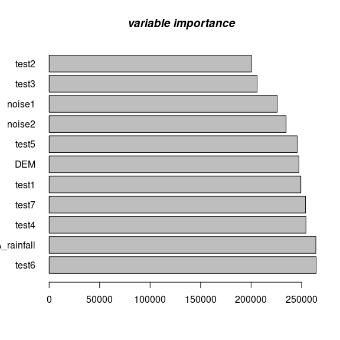
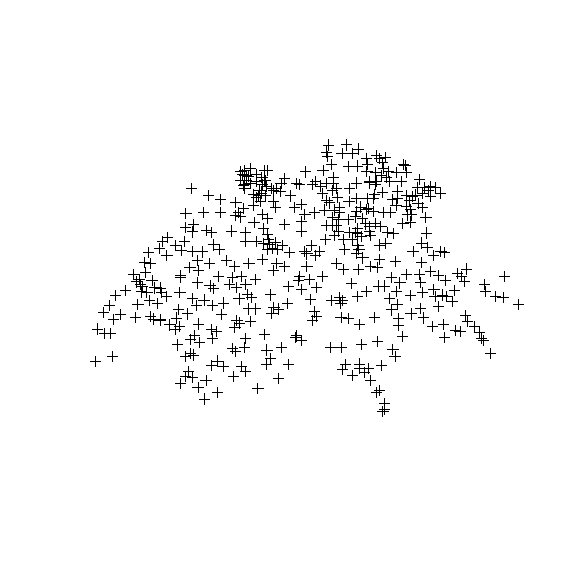

-   [Introduction](#introduction)
-   [`train_spm`](#train_spm)
-   [`predict_spm`](#predict_spm)
-   [`plot_spm`](#plot_spm)
-   [Required packages](#required-packages)
-   [sic1997: The SIC 1997 Data Set](#sic1997-the-sic-1997-data-set)
-   [Loading required libraries:](#loading-required-libraries)
-   [`train_spm`](#train_spm-1)
-   [`predict_spm`](#predict_spm-1)
    -   [Predicted values for the *newdata* set (in this case
        df.tr):](#predicted-values-for-the-newdata-set-in-this-case-df.tr)
-   [`plot_spm`](#plot_spm-1)
    -   [spatial prediction on
        *rainfall*](#spatial-prediction-on-rainfall)
-   [References](#references)

Follow me on 

To install the most up-to-date version of eumap please use:

    # library(remotes)
    # remotes::install_git("https://gitlab.com/geoharmonizer_inea/eumap.git", subdir = 'R-package')

Introduction
------------

`eumap` package aims at providing easier access to EU environmental
maps. Basic functions train a spatial prediction model using [mlr3
package](https://mlr3.mlr-org.com/), (Lang et al., [2019](#ref-mlr3)),
and related extensions in the [mlr3
ecosystem](https://github.com/mlr-org/mlr3/wiki/Extension-Packages)
(Casalicchio et al., [2017](#ref-casalicchio2017openml); Lang et al.,
[2020](#ref-MichelLang2020mlr3book)), which includes spatial prediction
using [Ensemble Machine
Learning](https://koalaverse.github.io/machine-learning-in-R/stacking.html#stacking-software-in-r),
taking spatial coordinates and spatial cross-validation into account. In
a nutshell one can `train` an arbitrary `s3` **(spatial)dataframe** in
`mlr3` ecosystem by defining *df* and *target.variable* i.e., response.
To learn more about the [mlr3 ecosystem](https://mlr3.mlr-org.com/) best
refer to the mlr3 book by Becker et al. (Lang et al.,
[2020](#ref-MichelLang2020mlr3book)).

The main functions in eumap are as following:

`train_spm`
-----------

1.  `train_spm` will automatically perform `classification` or
    `regression` tasks and the output is a `train_model` which later can
    be used to predict `newdata`.It also provides *summary* of the model
    and *variable importance* and *response*. The rest of arguments can
    be either pass or default values will be passed. `train_spm`
    provides four scenarios:

1.1. `classification` task with **non spatial** resampling methods, 1.2.
`regression` task with **non spatial** resampling methods, 1.3.
`classification` task with **spatial** resampling methods, 1.4.
`regression` task with **spatial** resampling methods,

`predict_spm`
-------------

Here two arguments are important:

1.  `object` used to generate prediction on a new dataset,
2.  `newdata` user needs to set new observations which should be
    predicted,

`plot_spm`
----------

Here two scenarios are possible:

1.  1:1 accuracy plot predicted vs observed in case of regression task,
2.  Confusion matrix predicted vs observed in the case of classification
    task,

**Warning:** most of functions are optimized to run in parallel by
default. This might result in high RAM and CPU usage.

The following examples demonstrates spatial prediction using the `sic97`
data set:

Required packages
-----------------

    start_time <- Sys.time()
    ls <- c("lattice", "raster", "landmap", "plotKML", "ranger", "mlr3verse", "BBmisc", "knitr", "bbotk",
        "hexbin", "stringr", "magrittr", "sp", "ggplot2", "mlr3fselect", "mlr3spatiotempcv",  "tidyr", "lubridate", "R.utils", "terra","rgdal",'MLmetrics',
        "FSelectorRcpp", "future", "future.apply", "mlr3filters", "EnvStats", "grid", "mltools", "gridExtra", "yardstick", "latticeExtra", "devtools", "progressr")
    new.packages <- ls[!(ls %in% installed.packages()[,"Package"])]
    if(length(new.packages)) install.packages(new.packages, repos="https://cran.rstudio.com", force=TRUE)

sic1997: The SIC 1997 Data Set
------------------------------

For demonstration we are using daily rainfall dataset from Switzerland
used in the Spatial Interpolation Comparison 1997. For more information
about the data set please see
[HERE](https://rdrr.io/github/Envirometrix/landmap/man/sic1997.html).

    library("landmap")  

    version: 0.0.3

    data(sic1997)
    sic1997.df = cbind(as.data.frame(sic1997$daily.rainfall), 
                       as.data.frame(sp::over(sic1997$daily.rainfall, sic1997$swiss1km)))
    df.tr <- na.omit(sic1997.df)

Note that here we use whole the data to test and train the model, as the
dataset is not big (i.e., only 456 observations). In the training part,
however, there will be internal sampling that will provide the Out Of
Bag Error OOB R square! For mor detailed information see
[HERE](https://ieeexplore.ieee.org/abstract/document/9206124).

We can create some synthetic covariates, so we can demonstrate that (a)
the learner is noise-proof, and (b) that this is visible in the variable
importance plots:

    target.variable = "rainfall"
    df.tr$test1 <- log10(df.tr$DEM)*53.656
    df.tr$test2 <- cos(df.tr$DEM)*-0.13
    df.tr$test3 <- sin(df.tr$DEM)**31
    df.tr$test4 <- (df.tr$DEM)**-5.13
    df.tr$test5 <- (df.tr$DEM/2**4)**6
    df.tr$test6 <- (df.tr$CHELSA_rainfall)**-1
    df.tr$test7 <-((df.tr$CHELSA_rainfall)*13/34)
    df.tr$noise1 <- runif(1:nrow(df.tr))/0.54545
    df.tr$noise2 <- sqrt(runif(1:nrow(df.tr)))
    df.tr$border <- NULL
    df.tr$X <- NULL
    df.tr$Y <- NULL

where *noise1* and *noise2* are pure noises. Note that we shouldn’t use
non-numeric covariates in `train_spm` for regression tasks; in this case
*border*.

Loading required libraries:
---------------------------

    library("mlr3verse")
    library("mlr3spatiotempcv")
    library("sp")
    library("grid")
    library("hexbin")
    library("BBmisc")
    library("lattice")
    library("gridExtra")
    library("MLmetrics")
    library("yardstick")
    library("latticeExtra")
    library("eumap")
    library("ppcor")
    library("progressr")
    library("checkmate")
    library("future")
    library("scales")

`train_spm`
-----------

`train_spm` fits multiple models/learners (depending on the `class` of
the **target.variable**) and automatically tune all the underlying
hyperparameters using `AutoTuner` from
[mlr3](https://mlr3book.mlr-org.com/pipe-nonlinear.html) and returns a
`trained model`, **var.imp**, **summary** of the model, and **response**
variables. `trained model` later can predict a `newdata` set.

    tr = eumap::train_spm(df.tr, target.variable = "rainfall", folds = 5, n_evals = 15)

    Fitting an ensemble ML using kknn featureless, and ranger models ncores: 32TRUE

    Regression Task...TRUE

    Using resampling method: (non-spatial) repeated_cv...TRUE

`train_spm` results:

1st element is the *trained model*:

    train_model= tr[[1]]

2nd element is the *variable importance*:

    Vim = tr[[2]]

3rd element is the summary of the *trained model*. Note that the *R
squared (OOB)* shows the performance evaluation of the model during
training which sample fraction for different batches varies from 50% to
70%.

    tr[[3]]

    Ranger result

    Call:
     ranger::ranger(dependent.variable.name = task$target_names, data = task$data(),      case.weights = task$weights$weight, importance = "impurity",      mtry = 2L, sample.fraction = 0.600770418648608, num.trees = 338L) 

    Type:                             Regression 
    Number of trees:                  338 
    Sample size:                      456 
    Number of independent variables:  11 
    Mtry:                             2 
    Target node size:                 5 
    Variable importance mode:         impurity 
    Splitrule:                        variance 
    OOB prediction error (MSE):       11114.4 
    R squared (OOB):                  0.1257299 

4th element is the predicted values of our trained model note: here we
just show start and the ending values

    response = tr[[4]]

`predict_spm`
-------------

Prediction on `newdata` data set (in this case df.tr).

    predict.variable = eumap::predict_spm(train_model, df.tr)

### Predicted values for the *newdata* set (in this case df.tr):

Note: here we just show the start and the ending values.

    pred.v = predict.variable[1]
    pred.v

    ...
    [[1]]
      [1] 171.82140 158.32544 166.81849 168.05671 157.13037 162.66144 178.31395
    ...

`plot_spm`
----------

In case of regression task,

    plt = plot_spm(x = df.tr[,target.variable], y = pred.v[[1]], gtype = "accuracy", gmode  = "norm" )

    Because of the LOW number of observations a density plot is displayed.

    plt

Accuracy plot

When there is limited number of observation (x &lt; 500) `plot_spm`
automatically generates a density plot and ignores all the other
graphical arguments.

    plt = plot_spm(Vim = tr[[2]], gtype = "var.imp") #x = df.tr[,target.variable], y = pred.v[[1]],

### spatial prediction on *rainfall*

    plot(df.tr[,"rainP"])

We made a spatial prediction map using ensemble machine learning with
spatial cross validation for the predicted variable e.g., *rainfall* (in
this case). Ranger shows that it is a noise proof classifier.

References
----------

Casalicchio, G., Bossek, J., Lang, M., Kirchhoff, D., Kerschke, P.,
Hofner, B., … Bischl, B. (2017). OpenML: An R package to connect to the
machine learning platform OpenML. *Computational Statistics*, 1–15.
doi:[10.1007/s00180-017-0742-2](https://doi.org/10.1007/s00180-017-0742-2)

Lang, M., Binder, M., Richter, J., Schratz, P., Pfisterer, F., Coors,
S., … Bischl, B. (2019). mlr3: A modern object-oriented machine learning
framework in R. *Journal of Open Source Software*.
doi:[10.21105/joss.01903](https://doi.org/10.21105/joss.01903)

Lang, M., Schratz, P., Binder, M., Pfisterer, F., Richter, J., Reich, N.
G., & Bischl, B. (2020, September 9). mlr3 book. Retrieved from
<https://mlr3book.mlr-org.com>
