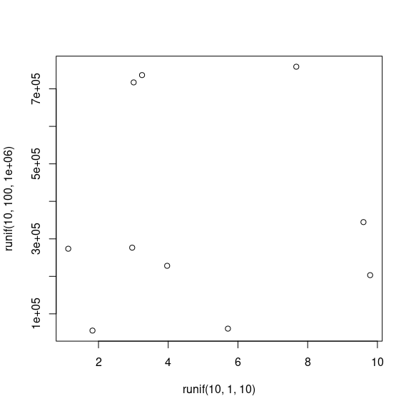

-   [Introduction](#introduction)
-   [`train_spm`](#train_spm)
-   [`predict_spm`](#predict_spm)
-   [`accuracy_plot`](#accuracy_plot)
-   [Required packages](#required-packages)
-   [meuse dataset](#meuse-dataset)
-   [split training (tr) and test (ts)
    set](#split-training-tr-and-test-ts-set)
-   [setting generic variables](#setting-generic-variables)
-   [setting generic accuracy plot
    variables](#setting-generic-accuracy-plot-variables)
-   [Loading required libraries:](#loading-required-libraries)
-   [`train_spm`](#train_spm-1)
-   [`predict_spm`](#predict_spm-1)
    -   [predicted values for the *newdata*
        set:](#predicted-values-for-the-newdata-set)
-   [`accuracy_plot_spm`](#accuracy_plot_spm)
-   [raster grid](#raster-grid)
-   [Croatia tile](#croatia-tile)
    -   [Overlay Demonstration](#overlay-demonstration)
    -   [reading Croatia data](#reading-croatia-data)
    -   [`stripe_years`](#stripe_years)
    -   [`extract_tif`](#extract_tif)
-   [Space-Time Overlay](#space-time-overlay)
-   [pre-processing Croatia data](#pre-processing-croatia-data)
-   [train\_spm](#train_spm-2)
-   [predict\_spm](#predict_spm-2)
    -   [get ride of small classess in
        prediction](#get-ride-of-small-classess-in-prediction)
-   [References](#references)

Follow me on 

Introduction
------------

`eumap` aims at providing easier access to EU environmental maps. Basic
functions train a spatial prediction model using [mlr3
package](https://mlr3.mlr-org.com/), (Lang et al., [2019](#ref-mlr3)),
and related extensions in the [mlr3
ecosystem](https://github.com/mlr-org/mlr3/wiki/Extension-Packages)
(Casalicchio et al., [2017](#ref-casalicchio2017openml); Lang et al.,
[2020](#ref-MichelLang2020mlr3book)), which includes spatial prediction
using [Ensemble Machine
Learning](https://koalaverse.github.io/machine-learning-in-R/stacking.html#stacking-software-in-r)
taking spatial coordinates and spatial cross-validation into account. In
a nutshell one can `train` an arbitrary `s3` **(spatial)dataframe** in
`mlr3` ecosystem by defining *df* and *target.variable* i.e., response.
main functions are as the following:

`train_spm`
-----------

1.  `train_spm` will automatically perform `classification` or
    `regression` tasks and the output is a `train_model` which later can
    be used to predict `newdata`.It also provides *summary* of the model
    and *variable importance* and *response*. The rest of arguments can
    be either pass or default values will be passed. `train_spm`
    provides four scenarios:

1.1. `classification` task with **non spatial** resampling methods 1.2.
`regression` task with **non spatial** resampling methods 1.3.
`classification` task with **spatial** resampling methods 1.4.
`regression` task with **spatial** resampling methods

`predict_spm`
-------------

1.  Prediction on a new dataset using `train_model`,
2.  User needs to set`df.ts = test set` and also pass the `train_model`.

`accuracy_plot`
---------------

1.  Accuracy plot in case of regression task (don’t use it for
    classification tasks for obvious reason),

**Warning:** most of functions are optimized to run in parallel by
default. This might result in high RAM and CPU usage.

The following examples demonstrates spatial prediction using the `meuse`
data set:

Required packages
-----------------

    start_time <- Sys.time()
    ls <- c("lattice", "raster", "plotKML", "ranger", "mlr3verse", "BBmisc", "knitr", "bbotk",
        "hexbin", "stringr", "magrittr", "sp", "ggplot2", "mlr3fselect", "mlr3spatiotempcv",  "tidyr", "lubridate", "R.utils", "terra","rgdal",
        "FSelectorRcpp", "future", "future.apply", "mlr3filters", "EnvStats", "grid", "mltools","gridExtra","yardstick","plotKML", "latticeExtra","devtools")
    new.packages <- ls[!(ls %in% installed.packages()[,"Package"])]
    if(length(new.packages)) install.packages(new.packages, repos="https://cran.rstudio.com", force=TRUE)

meuse dataset
-------------

    library("sp")
    demo(meuse, echo=FALSE)
    pr.vars = c("x","y","dist","ffreq","soil","lead")
    df <- as.data.frame(meuse)
    df.grid <- as.data.frame(meuse.grid)
    # df <- df[complete.cases(df[,pr.vars]),pr.vars]
    df = na.omit(df[,])
    df.grid = na.omit(df.grid[,])
    summary(is.na(df))
    summary(is.na(df.grid))
    crs = "+init=epsg:28992"
    target.variable = "lead"

split training (tr) and test (ts) set
-------------------------------------

    smp_size <- floor(0.5 * nrow(df))
    set.seed(123)
    train_ind <- sample(seq_len(nrow(df)), size = smp_size)
    df.tr <- df[, c("x","y","dist","ffreq","soil","lead")]
    df.ts <- df.grid[, c("x","y","dist","ffreq","soil")]

setting generic variables
-------------------------

    folds = 2
    n_evals = 3
    newdata = df.ts

setting generic accuracy plot variables
---------------------------------------

    colorcut. = c(0,0.01,0.03,0.07,0.15,0.25,0.5,0.75,1)
    colramp. = colorRampPalette(c("wheat2","red3"))
    xbins. = 50

Loading required libraries:
---------------------------

    library("mlr3verse")
    library("bbotk")
    library("ggplot2")
    library("mltools")
    library("data.table")
    library("mlr3fselect")
    library("FSelectorRcpp")
    library("future")
    library("future.apply")
    library("magrittr")
    library("progress")
    library("mlr3spatiotempcv")
    library("sp")
    library("landmap")  
    library("dplyr")
    library("EnvStats")
    library("grid")
    library("hexbin")
    library("BBmisc")
    library("lattice")
    library("MASS")
    library("gridExtra")
    library("MLmetrics")
    library("yardstick")
    library("plotKML")
    library("latticeExtra")
    library("devtools")
    library("raster")
    library("rgdal")
    library("eumap")

`train_spm`
-----------

`train_spm` fits multiple models/learners depending on the `class` of
the **target.variable** and for returns a `trained model`, **var.imp**,
**summary** of the model, and **response** variables. `trained model`
later can predict a `newdata` set.

    tr = eumap::train_spm(df.tr, target.variable = target.variable , folds = folds , n_evals = n_evals , crs = "+init=epsg:28992")

             fit the regression model  (rsmp = SPCV by cooridinates) ...TRUE

`train_spm` results:

1st element is the *trained model*:

    train_model= tr[[1]]

2nd element is the *variable importance*:

    var.imp = tr[[2]]
    var.imp

        dist    ffreq     soil 
    4199.005 2418.450 1898.147 

3rd element of the summary of the *trained model*:

    summary = tr[[3]]
    summary

    Ranger result

    Call:
     ranger::ranger(dependent.variable.name = task$target_names, data = task$data(),      case.weights = task$weights$weight, importance = "permutation") 

    Type:                             Regression 
    Number of trees:                  500 
    Sample size:                      152 
    Number of independent variables:  9 
    Mtry:                             3 
    Target node size:                 5 
    Variable importance mode:         permutation 
    Splitrule:                        variance 
    OOB prediction error (MSE):       6721.765 
    R squared (OOB):                  0.4579194 

4th element is the predicted values of our trained model note: here we
just show start and the ending values

    response = tr[[4]]
    response

    ...
      [1] 268.05358 244.43426 205.18133 155.55110 119.10944 111.98254 152.94772
      [8] 221.80734 207.79976 113.21834 112.47830 194.11921 267.23847 205.43335
     [15] 210.43176 270.52192 251.40160 249.41321 272.16468 269.21231 225.45011
    ...

`predict_spm`
-------------

prediction on `newdata` set

    predict.variable = eumap::predict_spm(train_model, newdata)

### predicted values for the *newdata* set:

note: here we just show start and the ending values

    predict.variable

    ...
       [1] 266.38482 266.38482 244.39279 249.56899 266.38482 244.39279 241.15656
       [8] 250.57212 266.22951 244.39279 241.15656 250.57212 223.56810 212.50498
    ...

`accuracy_plot_spm`
-------------------

in case of regression task, - for now we have two scenarios including: -
rng = “nat” provides visualizations with real values - rng = “norm”
provides visualizations with the normalized (0~1) values

    plt = eumap::accuracy_plot_spm(x = df.tr[,target.variable], y = response, rng = "norm")

Accuracy plot

raster grid
-----------

make a map using ensemble machine learning with spatial cross validation
for the predicted variables e.g., *lead* (in this case)

    plot(df.ts[,"leadp"])
    points(meuse, pch="+")

Raster grid

Croatia tile
------------

### Overlay Demonstration

we will use the eumap package to overlay all the points of a vector
layer (geopackage file) on several raster layers (geotiff files), using
the SpaceOverlay and SpaceTimeOverlay classes to handle with timeless
and temporal layers, respectively. In our dataset the elevation and
slope, based on digital terrain model, are timeless and the landsat
composites (7 spectral bands, 4 seasons and 3 percentiles) and night
light (VIIRS Night Band) layers are temporal (from 2000 to 2020).

### reading Croatia data

Our dataset refers to 1 tile, located in Croatia, extracted from a
tiling system created for European Union (7,042 tiles) by [GeoHarmonizer
Project](https://opendatascience.eu/).

    tif1.lst = list.files("/data/eumap/sample-data/R-sample-tiles/9529", pattern=".tif", full.names=TRUE, recursive=TRUE) 
    df = readOGR("/data/eumap/sample-data/R-sample-tiles/9529_croatia_landcover_samples.gpkg")

    OGR data source with driver: GPKG 
    Source: "/data/eumap/sample-data/R-sample-tiles/9529_croatia_landcover_samples.gpkg", layer: "9529_croatia_landcover_samples"
    with 759 features
    It has 5 fields

    df <- as.data.frame(df)
    df$Date = format.Date(as.Date(paste(df$survey_date), format="%Y/%m/%d"), "%Y-%m-%d")
    df$row.id = 1:nrow(df)

### `stripe_years`

    begin.tif1.lst = sapply(tif1.lst, function(i){strip_years(i, type="begin")})
    end.tif1.lst = sapply(tif1.lst, function(i){strip_years(i, type="end")})
    unique(end.tif1.lst)

     [1] "2000-12-31" "2001-12-31" "2002-12-31" "2003-12-31" "2004-12-31"
     [6] "2005-12-31" "2006-12-31" "2007-12-31" "2008-12-31" "2009-12-31"
    [11] "2010-12-31" "2011-12-31" "2012-12-31" "2013-12-31" "2014-12-31"
    [16] "2015-12-31" "2016-12-31" "2017-12-31" "2018-12-31" "2019-12-31"
    [21] "2020-12-31"

### `extract_tif`

    cores = ifelse(parallel::detectCores()<length(tif1.lst), parallel::detectCores(), length(tif1.lst))
    ov.pnts <- parallel::mclapply(1:length(tif1.lst), function(i){ eumap::extract_tif(tif=tif1.lst[i], df, date="Date", date.tif.begin=begin.tif1.lst[i], date.tif.end=end.tif1.lst[i], coords=c("coords.x1","coords.x2")) }, mc.cores=cores)
    gc()

              used  (Mb) gc trigger  (Mb) max used  (Mb)
    Ncells 4845595 258.8    7892042 421.5  7892042 421.5
    Vcells 7712966  58.9   14786712 112.9 12255590  93.6

    ov.pnts = ov.pnts[!sapply(ov.pnts, is.null)]

    str(ov.pnts[1:6])

    List of 6
     $ :'data.frame':   180 obs. of  2 variables:
      ..$ landsat_ard_fall_blue_p25: num [1:180] 4 6 4 6 6 4 6 6 4 8 ...
      ..$ row.id                   : int [1:180] 3 4 7 15 18 20 26 28 32 36 ...
     $ :'data.frame':   180 obs. of  2 variables:
      ..$ landsat_ard_fall_blue_p50: num [1:180] 4 6 4 7 7 5 7 6 4 8 ...
      ..$ row.id                   : int [1:180] 3 4 7 15 18 20 26 28 32 36 ...
     $ :'data.frame':   180 obs. of  2 variables:
      ..$ landsat_ard_fall_blue_p75: num [1:180] 4 7 5 7 7 6 8 6 5 9 ...
      ..$ row.id                   : int [1:180] 3 4 7 15 18 20 26 28 32 36 ...
     $ :'data.frame':   180 obs. of  2 variables:
      ..$ landsat_ard_fall_green_p25: num [1:180] 12 13 10 14 13 11 15 14 11 17 ...
      ..$ row.id                    : int [1:180] 3 4 7 15 18 20 26 28 32 36 ...
     $ :'data.frame':   180 obs. of  2 variables:
      ..$ landsat_ard_fall_green_p50: num [1:180] 12 13 10 14 14 12 15 15 12 18 ...
      ..$ row.id                    : int [1:180] 3 4 7 15 18 20 26 28 32 36 ...
     $ :'data.frame':   180 obs. of  2 variables:
      ..$ landsat_ard_fall_green_p75: num [1:180] 12 14 10 15 14 13 17 15 12 19 ...
      ..$ row.id                    : int [1:180] 3 4 7 15 18 20 26 28 32 36 ...

Space-Time Overlay
------------------

For the temporal layers, the points should be filtered by year and
overlayed on the right raster files. The SpaceTimeOverlay class
implements this approach using the parameter: - timeless\_data: The
result of SpaceOverlay (GeoPandas DataFrame) - col\_date: The column
that contains the date information (2018-09-13) - dir\_temporal\_layers:
The directory where the temporal raster files are stored, organized by
year

    library(data.table)
    commcols <- Reduce(intersect, lapply(ov.pnts, names))
    L.dt <- lapply(ov.pnts, function(x) setkeyv(data.table(x), commcols))
    cmt <- do.call(cbind, L.dt) 
    uq.lst <- unique(colnames(cmt))
    cm.tif <- cmt[, .SD, .SDcols = unique(names(cmt))]
    df <- as.data.table(df)
    cm <- Reduce(merge,list(df,cm.tif))
    tt = cbind(cm,df$year)
    saveRDS(tt, "/data/eumap/sample-data/R-sample-tiles/9529/9529_croatia_samples.rds")

    str(tt)

    Classes 'data.table' and 'data.frame':  759 obs. of  96 variables:
     $ row.id                        : int  3 3 3 3 3 4 4 4 4 4 ...
     $ lucas                         : int  0 0 0 0 0 0 0 0 0 0 ...
     $ survey_date                   : chr  "2000/06/30" "2000/06/30" "2000/06/30" "2000/06/30" ...
     $ lc_class                      : int  324 324 324 324 324 321 321 321 321 321 ...
     $ tile_id                       : int  9529 9529 9529 9529 9529 9529 9529 9529 9529 9529 ...
     $ confidence                    : num  85 85 85 85 85 85 85 85 85 85 ...
     $ coords.x1                     : num  4770204 4770204 4770204 4770204 4770204 ...
     $ coords.x2                     : num  2414683 2414683 2414683 2414683 2414683 ...
     $ Date                          : chr  "2000-06-30" "2000-06-30" "2000-06-30" "2000-06-30" ...
     $ landsat_ard_fall_blue_p25     : num  4 4 4 4 4 6 6 6 6 6 ...
     $ landsat_ard_fall_blue_p50     : num  4 4 4 4 4 6 6 6 6 6 ...
     $ landsat_ard_fall_blue_p75     : num  4 4 4 4 4 7 7 7 7 7 ...
     $ landsat_ard_fall_green_p25    : num  12 12 12 12 12 13 13 13 13 13 ...
     $ landsat_ard_fall_green_p50    : num  12 12 12 12 12 13 13 13 13 13 ...
     $ landsat_ard_fall_green_p75    : num  12 12 12 12 12 14 14 14 14 14 ...
     $ landsat_ard_fall_nir_p25      : num  53 53 53 53 53 61 61 61 61 61 ...
     $ landsat_ard_fall_nir_p50      : num  56 56 56 56 56 61 61 61 61 61 ...
     $ landsat_ard_fall_nir_p75      : num  59 59 59 59 59 62 62 62 62 62 ...
     $ landsat_ard_fall_red_p25      : num  12 12 12 12 12 14 14 14 14 14 ...
     $ landsat_ard_fall_red_p50      : num  13 13 13 13 13 14 14 14 14 14 ...
     $ landsat_ard_fall_red_p75      : num  15 15 15 15 15 15 15 15 15 15 ...
     $ landsat_ard_fall_swir1_p25    : num  49 49 49 49 49 60 60 60 60 60 ...
     $ landsat_ard_fall_swir1_p50    : num  51 51 51 51 51 60 60 60 60 60 ...
     $ landsat_ard_fall_swir1_p75    : num  52 52 52 52 52 61 61 61 61 61 ...
     $ landsat_ard_fall_swir2_p25    : num  24 24 24 24 24 33 33 33 33 33 ...
     $ landsat_ard_fall_swir2_p50    : num  26 26 26 26 26 33 33 33 33 33 ...
     $ landsat_ard_fall_swir2_p75    : num  28 28 28 28 28 34 34 34 34 34 ...
     $ landsat_ard_fall_thermal_p25  : num  185 185 185 185 185 186 186 186 186 186 ...
     $ landsat_ard_fall_thermal_p50  : num  185 185 185 185 185 186 186 186 186 186 ...
     $ landsat_ard_fall_thermal_p75  : num  185 185 185 185 185 186 186 186 186 186 ...
     $ landsat_ard_spring_blue_p25   : num  5 5 5 5 5 6 6 6 6 6 ...
     $ landsat_ard_spring_blue_p50   : num  6 6 6 6 6 6 6 6 6 6 ...
     $ landsat_ard_spring_blue_p75   : num  8 8 8 8 8 7 7 7 7 7 ...
     $ landsat_ard_spring_green_p25  : num  12 12 12 12 12 14 14 14 14 14 ...
     $ landsat_ard_spring_green_p50  : num  14 14 14 14 14 14 14 14 14 14 ...
     $ landsat_ard_spring_green_p75  : num  16 16 16 16 16 15 15 15 15 15 ...
     $ landsat_ard_spring_nir_p25    : num  67 67 67 67 67 59 59 59 59 59 ...
     $ landsat_ard_spring_nir_p50    : num  70 70 70 70 70 60 60 60 60 60 ...
     $ landsat_ard_spring_nir_p75    : num  70 70 70 70 70 60 60 60 60 60 ...
     $ landsat_ard_spring_red_p25    : num  11 11 11 11 11 15 15 15 15 15 ...
     $ landsat_ard_spring_red_p50    : num  13 13 13 13 13 16 16 16 16 16 ...
     $ landsat_ard_spring_red_p75    : num  17 17 17 17 17 17 17 17 17 17 ...
     $ landsat_ard_spring_swir1_p25  : num  50 50 50 50 50 59 59 59 59 59 ...
     $ landsat_ard_spring_swir1_p50  : num  53 53 53 53 53 60 60 60 60 60 ...
     $ landsat_ard_spring_swir1_p75  : num  59 59 59 59 59 62 62 62 62 62 ...
     $ landsat_ard_spring_swir2_p25  : num  23 23 23 23 23 30 30 30 30 30 ...
     $ landsat_ard_spring_swir2_p50  : num  25 25 25 25 25 31 31 31 31 31 ...
     $ landsat_ard_spring_swir2_p75  : num  31 31 31 31 31 33 33 33 33 33 ...
     $ landsat_ard_spring_thermal_p25: num  185 185 185 185 185 188 188 188 188 188 ...
     $ landsat_ard_spring_thermal_p50: num  185 185 185 185 185 188 188 188 188 188 ...
     $ landsat_ard_spring_thermal_p75: num  186 186 186 186 186 189 189 189 189 189 ...
     $ landsat_ard_summer_blue_p25   : num  5 5 5 5 5 6 6 6 6 6 ...
     $ landsat_ard_summer_blue_p50   : num  5 5 5 5 5 6 6 6 6 6 ...
     $ landsat_ard_summer_blue_p75   : num  5 5 5 5 5 7 7 7 7 7 ...
     $ landsat_ard_summer_green_p25  : num  12 12 12 12 12 14 14 14 14 14 ...
     $ landsat_ard_summer_green_p50  : num  12 12 12 12 12 15 15 15 15 15 ...
     $ landsat_ard_summer_green_p75  : num  13 13 13 13 13 16 16 16 16 16 ...
     $ landsat_ard_summer_nir_p25    : num  61 61 61 61 61 52 52 52 52 52 ...
     $ landsat_ard_summer_nir_p50    : num  61 61 61 61 61 54 54 54 54 54 ...
     $ landsat_ard_summer_nir_p75    : num  64 64 64 64 64 55 55 55 55 55 ...
     $ landsat_ard_summer_red_p25    : num  11 11 11 11 11 16 16 16 16 16 ...
     $ landsat_ard_summer_red_p50    : num  11 11 11 11 11 17 17 17 17 17 ...
     $ landsat_ard_summer_red_p75    : num  12 12 12 12 12 19 19 19 19 19 ...
     $ landsat_ard_summer_swir1_p25  : num  49 49 49 49 49 63 63 63 63 63 ...
     $ landsat_ard_summer_swir1_p50  : num  51 51 51 51 51 64 64 64 64 64 ...
     $ landsat_ard_summer_swir1_p75  : num  51 51 51 51 51 65 65 65 65 65 ...
     $ landsat_ard_summer_swir2_p25  : num  24 24 24 24 24 34 34 34 34 34 ...
     $ landsat_ard_summer_swir2_p50  : num  24 24 24 24 24 35 35 35 35 35 ...
     $ landsat_ard_summer_swir2_p75  : num  24 24 24 24 24 36 36 36 36 36 ...
     $ landsat_ard_summer_thermal_p25: num  186 186 186 186 186 188 188 188 188 188 ...
     $ landsat_ard_summer_thermal_p50: num  186 186 186 186 186 189 189 189 189 189 ...
     $ landsat_ard_summer_thermal_p75: num  186 186 186 186 186 190 190 190 190 190 ...
     $ landsat_ard_winter_blue_p25   : num  6 6 6 6 6 23 23 23 23 23 ...
     $ landsat_ard_winter_blue_p50   : num  6 6 6 6 6 28 28 28 28 28 ...
     $ landsat_ard_winter_blue_p75   : num  6 6 6 6 6 28 28 28 28 28 ...
     $ landsat_ard_winter_green_p25  : num  15 15 15 15 15 32 32 32 32 32 ...
     $ landsat_ard_winter_green_p50  : num  15 15 15 15 15 36 36 36 36 36 ...
     $ landsat_ard_winter_green_p75  : num  15 15 15 15 15 37 37 37 37 37 ...
     $ landsat_ard_winter_nir_p25    : num  70 70 70 70 70 75 75 75 75 75 ...
     $ landsat_ard_winter_nir_p50    : num  70 70 70 70 70 75 75 75 75 75 ...
     $ landsat_ard_winter_nir_p75    : num  70 70 70 70 70 75 75 75 75 75 ...
     $ landsat_ard_winter_red_p25    : num  15 15 15 15 15 35 35 35 35 35 ...
     $ landsat_ard_winter_red_p50    : num  15 15 15 15 15 38 38 38 38 38 ...
     $ landsat_ard_winter_red_p75    : num  15 15 15 15 15 39 39 39 39 39 ...
     $ landsat_ard_winter_swir1_p25  : num  59 59 59 59 59 42 42 42 42 42 ...
     $ landsat_ard_winter_swir1_p50  : num  59 59 59 59 59 49 49 49 49 49 ...
     $ landsat_ard_winter_swir1_p75  : num  59 59 59 59 59 56 56 56 56 56 ...
     $ landsat_ard_winter_swir2_p25  : num  31 31 31 31 31 21 21 21 21 21 ...
     $ landsat_ard_winter_swir2_p50  : num  31 31 31 31 31 25 25 25 25 25 ...
     $ landsat_ard_winter_swir2_p75  : num  31 31 31 31 31 29 29 29 29 29 ...
     $ landsat_ard_winter_thermal_p25: num  186 186 186 186 186 184 184 184 184 184 ...
     $ landsat_ard_winter_thermal_p50: num  186 186 186 186 186 185 185 185 185 185 ...
     $ landsat_ard_winter_thermal_p75: num  186 186 186 186 186 185 185 185 185 185 ...
     $ night_lights                  : num  0.125 0.125 0.125 0.125 0.125 ...
     $ dtm_elevation                 : num  721 978 698 727 450 668 626 698 833 561 ...
     $ dtm_slope                     : num  3.95 19 12.92 33.38 15.56 ...
     - attr(*, ".internal.selfref")=<externalptr> 
     - attr(*, "sorted")= chr "row.id"

pre-processing Croatia data
---------------------------

    cm.croatia <- readRDS("/data/eumap/sample-data/R-sample-tiles/9529/9529_croatia_samples.rds")

    

    df <-  cm.croatia
    df$lc_class <- as.factor(df$lc_class)
    crs = "+init=epsg:3035"
    target.variable = "lc_class"
    df <- df %>% group_by_if(is.character, as.factor)
    df$row.id <- NULL
    df$survey_date <- NULL
    df$lucas <- NULL
    df$Date <- NULL
    df$id <- NULL
    df$year <- NULL
    df$tile_id <- NULL
    df$confidence <- NULL
    df$V2 <- NULL
    df$coords.x1 <- NULL
    df$coords.x2 <- NULL
    colnames(df)

     [1] "lc_class"                       "landsat_ard_fall_blue_p25"     
     [3] "landsat_ard_fall_blue_p50"      "landsat_ard_fall_blue_p75"     
     [5] "landsat_ard_fall_green_p25"     "landsat_ard_fall_green_p50"    
     [7] "landsat_ard_fall_green_p75"     "landsat_ard_fall_nir_p25"      
     [9] "landsat_ard_fall_nir_p50"       "landsat_ard_fall_nir_p75"      
    [11] "landsat_ard_fall_red_p25"       "landsat_ard_fall_red_p50"      
    [13] "landsat_ard_fall_red_p75"       "landsat_ard_fall_swir1_p25"    
    [15] "landsat_ard_fall_swir1_p50"     "landsat_ard_fall_swir1_p75"    
    [17] "landsat_ard_fall_swir2_p25"     "landsat_ard_fall_swir2_p50"    
    [19] "landsat_ard_fall_swir2_p75"     "landsat_ard_fall_thermal_p25"  
    [21] "landsat_ard_fall_thermal_p50"   "landsat_ard_fall_thermal_p75"  
    [23] "landsat_ard_spring_blue_p25"    "landsat_ard_spring_blue_p50"   
    [25] "landsat_ard_spring_blue_p75"    "landsat_ard_spring_green_p25"  
    [27] "landsat_ard_spring_green_p50"   "landsat_ard_spring_green_p75"  
    [29] "landsat_ard_spring_nir_p25"     "landsat_ard_spring_nir_p50"    
    [31] "landsat_ard_spring_nir_p75"     "landsat_ard_spring_red_p25"    
    [33] "landsat_ard_spring_red_p50"     "landsat_ard_spring_red_p75"    
    [35] "landsat_ard_spring_swir1_p25"   "landsat_ard_spring_swir1_p50"  
    [37] "landsat_ard_spring_swir1_p75"   "landsat_ard_spring_swir2_p25"  
    [39] "landsat_ard_spring_swir2_p50"   "landsat_ard_spring_swir2_p75"  
    [41] "landsat_ard_spring_thermal_p25" "landsat_ard_spring_thermal_p50"
    [43] "landsat_ard_spring_thermal_p75" "landsat_ard_summer_blue_p25"   
    [45] "landsat_ard_summer_blue_p50"    "landsat_ard_summer_blue_p75"   
    [47] "landsat_ard_summer_green_p25"   "landsat_ard_summer_green_p50"  
    [49] "landsat_ard_summer_green_p75"   "landsat_ard_summer_nir_p25"    
    [51] "landsat_ard_summer_nir_p50"     "landsat_ard_summer_nir_p75"    
    [53] "landsat_ard_summer_red_p25"     "landsat_ard_summer_red_p50"    
    [55] "landsat_ard_summer_red_p75"     "landsat_ard_summer_swir1_p25"  
    [57] "landsat_ard_summer_swir1_p50"   "landsat_ard_summer_swir1_p75"  
    [59] "landsat_ard_summer_swir2_p25"   "landsat_ard_summer_swir2_p50"  
    [61] "landsat_ard_summer_swir2_p75"   "landsat_ard_summer_thermal_p25"
    [63] "landsat_ard_summer_thermal_p50" "landsat_ard_summer_thermal_p75"
    [65] "landsat_ard_winter_blue_p25"    "landsat_ard_winter_blue_p50"   
    [67] "landsat_ard_winter_blue_p75"    "landsat_ard_winter_green_p25"  
    [69] "landsat_ard_winter_green_p50"   "landsat_ard_winter_green_p75"  
    [71] "landsat_ard_winter_nir_p25"     "landsat_ard_winter_nir_p50"    
    [73] "landsat_ard_winter_nir_p75"     "landsat_ard_winter_red_p25"    
    [75] "landsat_ard_winter_red_p50"     "landsat_ard_winter_red_p75"    
    [77] "landsat_ard_winter_swir1_p25"   "landsat_ard_winter_swir1_p50"  
    [79] "landsat_ard_winter_swir1_p75"   "landsat_ard_winter_swir2_p25"  
    [81] "landsat_ard_winter_swir2_p50"   "landsat_ard_winter_swir2_p75"  
    [83] "landsat_ard_winter_thermal_p25" "landsat_ard_winter_thermal_p50"
    [85] "landsat_ard_winter_thermal_p75" "night_lights"                  
    [87] "dtm_elevation"                  "dtm_slope"                     

    # colnames(df)[4] <- "x"
    # colnames(df)[5] <- "y"
    coordinate_names = c("x","y")
    smp_size <- floor(0.5 * nrow(df))
    set.seed(123)
    train_ind <- sample(seq_len(nrow(df)), size = smp_size)
    df.tr <- df[train_ind, ]
    df.ts <- df[ -train_ind,]
    folds = 5  #you can change the number to get a better result
    n_evals = 5  #you can change the number to get a better result
    newdata = df.ts

train\_spm
----------

    tr = eumap::train_spm(df.tr, target.variable = target.variable , folds = folds , n_evals = n_evals)

    classification Task   resampling method: non-spatialCV  ncores:  32 ...TRUE

    Using learners: method.list...TRUE

               Fitting a ensemble ML using 'mlr3::TaskClassif'...TRUE

    ...
    DEBUG [17:13:18.134] Skip subsetting of task 'df.tr' 
    DEBUG [17:13:18.137] Calling train method of Learner 'classif.ranger.tuned' on task 'df.tr' with 379 observations {learner: <AutoTuner/Learner/R6>}
     ......................................
    Warning: Dropped unused factor level(s) in dependent variable: 131.

    Warning: Dropped unused factor level(s) in dependent variable: 131.

    ...
    INFO  [17:13:48.211] Finished benchmark 
    INFO  [17:13:48.419] Result of batch 5: 
    INFO  [17:13:48.422]  mtry sample.fraction num.trees  importance classif.acc 
    ...

    Warning: Dropped unused factor level(s) in dependent variable: 131.

    ...
    DEBUG [17:13:48.533] Learner 'classif.ranger' on task 'df.tr' succeeded to fit a model {learner: <LearnerClassifRanger/LearnerClassif/Learner/R6>, result: <ranger>, messages: }
    DEBUG [17:13:48.543] Learner 'classif.ranger.tuned' on task 'df.tr' succeeded to fit a model {learner: <AutoTuner/Learner/R6>, result: <list>, messages: }
    DEBUG [17:13:48.553] Skip subsetting of task 'df.tr' 
    ...

    Warning: Dropped unused factor level(s) in dependent variable: 131.

    ...
    DEBUG [17:13:48.609] Learner 'classif.ranger' on task 'df.tr' succeeded to fit a model {learner: <LearnerClassifRanger/LearnerClassif/Learner/R6>, result: <ranger>, messages: }
    ...

    train_model= tr[[1]]
    var.imp = tr[[2]]
    length(var.imp )

    ...
    [1] 87
    ...

    summary = tr[[3]]
    summary

    ...
    Ranger result

    Call:
    ...

    pred.model = tr[[4]]
    pred.model

    ...
      [1] 311 324 311 324 324 324 324 231 312 231 324 311 324 324 231 324 231 321
     [19] 324 324 312 231 231 324 124 324 324 324 311 231 231 324 324 231 324 324
     [37] 231 321 231 231 324 124 312 311 324 231 231 311 311 324 333 324 311 312
    ...

predict\_spm
------------

Prediction; raster map

    year.span = c(2000:2020)
    #
    aq =c("/data/eumap/sample-data/R-sample-tiles/9529/timeless/dtm_elevation.tif" ,"/data/eumap/sample-data/R-sample-tiles/9529/timeless/dtm_slope.tif")
    for (i in 1:2) {
      tif1.lst = list.files(paste0('/data/eumap/sample-data/R-sample-tiles/9529/',year.span[i]), pattern=".tif", full.names=TRUE, recursive=TRUE)
      tif1.lst <- append(tif1.lst, aq)
      out.tif <- paste0("/data/eumap/img/R/","land_cover_9529_croatia_",year.span[i],".tif")
      br01 = stack(tif1.lst)
      newdata = as(br01, "SpatialGridDataFrame")
      predict.ts = predict_spm(train_model, newdata@data)
      newdata$pred = predict.ts
      newdataa <- newdata ## copy and make new raster object
      newdataa@data$pred <- as.numeric(levels(newdataa@data$pred))[newdataa@data$pred]
      writeGDAL(newdataa["pred"], out.tif, drivername="GTiff", type="Int16", mvFlag = -32768 ,options=c("COMPRESS=DEFLATE"))
    }

### get ride of small classess in prediction

optional

    xg <- summary(newdata$pred, maxsum=(1+length(levels(newdata$pred))))
    str(xg)
    selg.levs <- attr(xg, "names")[xg > 5]  
    attr(xg, "names")[xg <= 5] #drop classes with less than 5 pixels
    newdata$pred[which(!newdata$pred %in% selg.levs)] <- NA
    newdata$pred <- droplevels(newdata$pred)
    str(summary(newdata$pred, maxsum=length(levels(newdata$pred))))

    plot(runif(10,1,10),runif(10,100,1e6))

LC map

References
----------

Casalicchio, G., Bossek, J., Lang, M., Kirchhoff, D., Kerschke, P.,
Hofner, B., … Bischl, B. (2017). OpenML: An R package to connect to the
machine learning platform OpenML. *Computational Statistics*, 1–15.
doi:[10.1007/s00180-017-0742-2](https://doi.org/10.1007/s00180-017-0742-2)

Lang, M., Binder, M., Richter, J., Schratz, P., Pfisterer, F., Coors,
S., … Bischl, B. (2019). mlr3: A modern object-oriented machine learning
framework in R. *Journal of Open Source Software*.
doi:[10.21105/joss.01903](https://doi.org/10.21105/joss.01903)

Lang, M., Schratz, P., Binder, M., Pfisterer, F., Richter, J., Reich, N.
G., & Bischl, B. (2020, September 9). mlr3 book. Retrieved from
<https://mlr3book.mlr-org.com>
