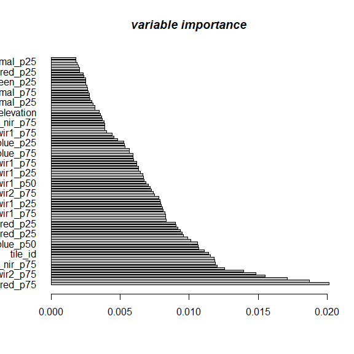
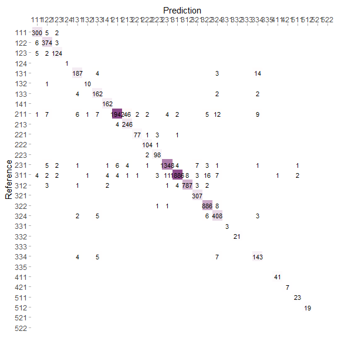

-   [Loading required libraries:](#loading-required-libraries)
-   [pre-processing](#pre-processing)
-   [`train_spm`](#train_spm)
-   [`predict_spm`](#predict_spm)
-   [`plot_spm`](#plot_spm)
    -   [variable importance](#variable-importance)
    -   [confusion matrix](#confusion-matrix)

Loading required libraries:
---------------------------

    library("eumap")

    # core libraries###
    library(mlr3verse)
    library(mlr3tuning)
    library(mlr3spatiotempcv)
    library(future)
    library(checkmate)

    # graphical libraries###
    library(likert)
    library(cvms)
    library(broom)    
    library(tibble)   
    library(ggimage)   
    library(rsvg)   
    library(grid)
    library(hexbin)
    library(BBmisc)
    library(lattice)
    library(gridExtra)
    library(latticeExtra)

    # mathematical and geospatial libraries###
    library(sp)
    library(caret)
    library(MLmetrics)
    library(yardstick)
    library(ppcor)
    library(progressr)
    library(scales)

    # file <- 'https://drive.google.com/file/d/1Y3ao-SkWjhjaBQiXvgDq03ecYFE0WOFH/view?usp=sharing' 
    # #you can download the file using this link.
    # download.file(file, destfile)
    # in.data = 'C:/Enter/gitrepo/eumap/sample.RData'
    load('C://Users/mohammad-reza/Downloads/sample.RData')

pre-processing
--------------

    sample$clc3_red <- as.factor(sample$clc3_red)
    sample$X <- NULL

    Warning in set(x, j = name, value = value): Column 'X' does not exist to remove

    sample$confidence <- NULL
    sample$ecoregion_id <- NULL
    sample$gsw_occurrence_1984_2019 <- NULL

`train_spm`
-----------

    target.variable = "clc3_red"
    df.tr = 'sample'
    tr = train_spm(df.tr = data.frame(sample), target.variable = target.variable, folds = 2, n_evals = 1)

    Fitting an ensemble ML using kknn featureless, and ranger models ncores: 8TRUE

    classification Task...TRUE

    Using resampling method: (non-spatial) repeated_cv...TRUE

    train_model = tr[[1]]
    Vim = tr[[2]]
    tr[[3]]
    response = tr[[4]]

`predict_spm`
-------------

    predict.variable = predict_spm(train_model, newdata = data.frame(sample))

    pred.v = predict.variable[1]

`plot_spm`
----------

### variable importance

    plot_spm( Vim = Vim, gtype = "var.imp")

### confusion matrix

    response = tr[[4]]
    target.variable = "clc3_red"
    df.tr = data.frame(sample)
    p = plot_spm(x = df.tr[,target.variable], y = pred.v[[1]], gtype = 'cm') 
    p

    Warning: Removed 796 rows containing missing values (geom_text).

