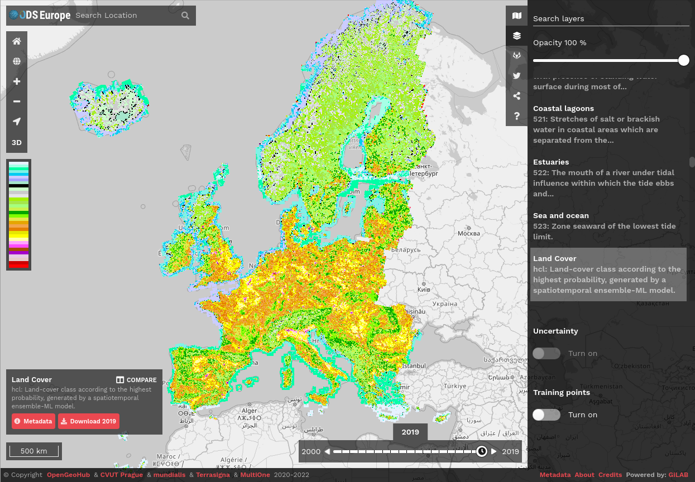
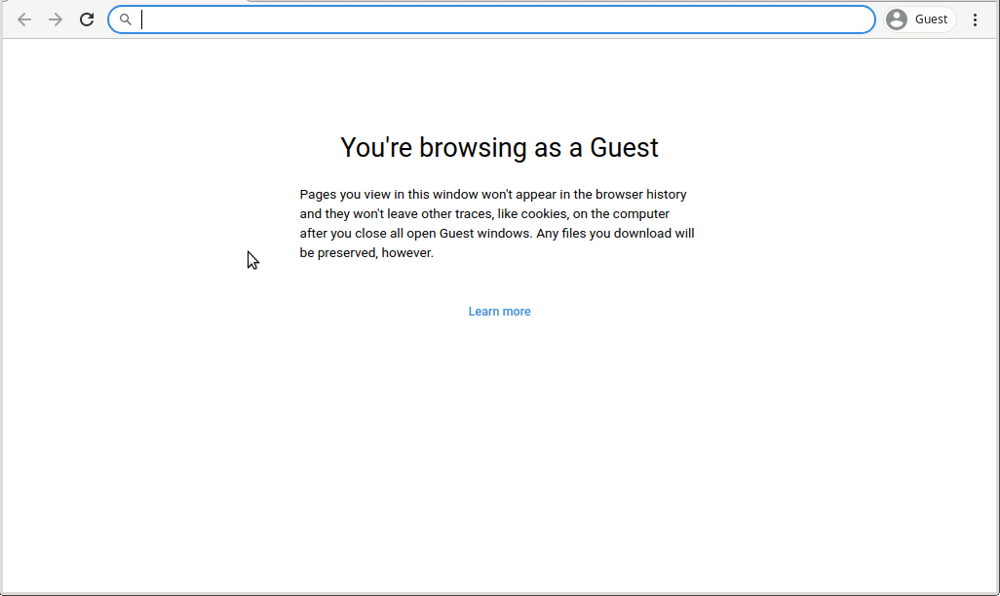

..
   Note: Items in this toctree form the top-level navigation. See `api.rst` for the `autosummary` directive, and for why `api.rst` isn't called directly.

.. toctree::
   :hidden:

   Home <self>
   Tutorials <tutorials>
   API Reference <_autosummary/eumap>

Eumap is a library to enable easier access to several **spatial layers prepared for Continental Europe** (*Landsat and Sentinel mosaics, DTM and climate datasets, land cover and vegetation maps*), as well the processing classes and functions used to produce them.

It implements efficient **raster access** through `rasterio <https://rasterio.readthedocs.io>`_, multiple **gapfiling** approaches, **spatial and spacetime overlay**, **training samples** preparation (LUCAS points), and **Ensemble Machine Learning** applied to spatial predictions (fully compatible with `scikit-learn <https://scikit-learn.org>`_).

The spatial layers can be also accessed through `ODSE Viewer <http://maps.opendatascience.eu>`_.

|

##################
Installation
##################

Docker
=================

The best way to install ``eumap`` is using Docker. Check the `official documentation <https://docs.docker.com/get-docker/>`_ to get Docker running in your environment.

JupyterLab Container
------------------

The image `opengeohub/pygeo-ide <https://hub.docker.com/r/opengeohub/pygeo-ide>`_ provides access to all ``eumap`` dependencies and to `JupyterLab <https://jupyterlab.readthedocs.io/en/stable/>`_ IDE. The follow instructions are specific for Intel CPUs, which supports `MKL <https://software.intel.com/content/www/us/en/develop/tools/oneapi/components/onemkl.html>`_, for other CPUs it's recommend to use the `openblas version <https://hub.docker.com/r/opengeohub/pygeo-ide/tags?page=1&ordering=last_updated>`_.
 
First, download the image:

.. code-block:: shell-session

   docker pull opengeohub/pygeo-ide:v3.8.6-mkl-gdal314

Then create the container:

.. code-block:: shell-session

   docker run -d --restart=always --name opengeohub_pygeo_ide -v /mnt:/mnt -p 8888:8888 -e GRANT_SUDO=yes --user root opengeohub/pygeo-ide:v3.8.6-mkl-gdal314 start.sh jupyter lab --LabApp.token='opengeohub' --ServerApp.root_dir='/'

As last step access the JupyterLab through http://localhost:8888 using the password **opengeohub**, open a terminal and install the ``eumap`` last version:

.. code-block:: shell-session
   
   pip install -e 'git+https://gitlab.com/geoharmonizer_inea/eumap.git#egg=eumap[full]'

Conda
=================

To install ``eumap`` using `conda <https://conda.io/projects/conda/en/latest/user-guide/install/index.html>`_, first it's necessary download the file `conda_env.yml <https://gitlab.com/geoharmonizer_inea/eumap/-/raw/master/conda_env.yml>`_:

.. code-block:: shell-session

   curl https://gitlab.com/geoharmonizer_inea/eumap/-/raw/master/conda_env.yml > ./conda_env.yml

Then use this file to create new a environment and activate it:

.. code-block:: shell-session
   
   # It will take a while
   conda env create --quiet --name eumap --file conda_env.yml
   conda activate eumap

As last step install the ``eumap``:

.. code-block:: shell-session
   
   pip install -e 'git+https://gitlab.com/geoharmonizer_inea/eumap.git#egg=eumap[full]'

##################
Contributing
##################
The ``eumap`` library has been developed and used by a group of active community members. Your help is very valuable to make the package better for everyone. Check our `contribution guidelines <https://gitlab.com/geoharmonizer_inea/eumap/-/blob/master/CONTRIBUTING.md>`_ and `open issues <https://gitlab.com/geoharmonizer_inea/eumap/-/issues?scope=all&state=opened>`_

##################
License
##################
© Contributors, 2020. Licensed under an `Apache-2 <https://gitlab.com/geoharmonizer_inea/eumap/blob/master/LICENSE>`_ license.

##################
Funding
##################

This work is co-financed under Grant Agreement Connecting Europe Facility (CEF) Telecom `project 2018-EU-IA-0095 <https://ec.europa.eu/inea/en/connecting-europe-facility/cef-telecom/2018-eu-ia-0095>`_ by the European Union.