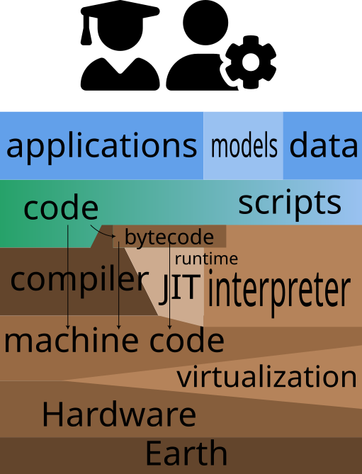

# Logo and diagrams

Diagrams are made with [inkscape](https://inkscape.org).

The palette I always use is [GNOME HIG](https://developer.gnome.org/hig/reference/palette.html), which is also a default inkscape palette.

I'm a bit worried about the logo colors Blue Marble (#18393E) and Terra (#6C6C4F) not matching..

so guess we'll make an inkscape palette to make everything nice?

So the inkscape palette is in [scikit-map.gpl](./scikit-map.gpl). Just link it to inkscape:

```bash
ln -s ./scikit-map.gpl ~/.config/inkscape/palettes/scikit-map.gpl
# ~/.var/app/org.inkscape.Inkscape/config/inkscape/palettes/
```

then open and close inkscape.

## palette guides:

- for diagrams, mainly use inner colors, they have Capital names like `Blue 1-5`
  - lower-case outer colors (`blue 0,6,7`) should be used sparingly
- For the logo, the darkest blue is named `Blue Marble`, this is the preferred color
  - Terra also has some shades, use the middle one, named `Terra`
  - Don't mix `Terra` and `Blue Marble`

color scheme is matched with this software-as-soil image:



- Python is blue
- C++ is green
- dependencies (GDAL) and other things we use but don't modify is brown
- Yellow is what guides development, but I haven't encountered that yet.


## Fonts

install [Roboto Slab](https://www.fontsquirrel.com/fonts/download/roboto-slab):

```bash
unzip /tmp/roboto-slab.zip ~/.local/share/fonts/
```


