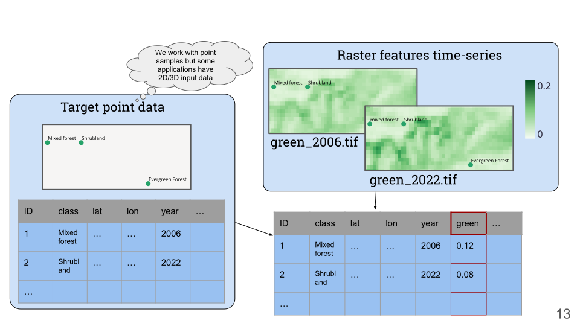

##########
Quickstart
##########

See :ref:`installation-section` for installation instructions.

Creating a catalog
==================

Every scikit-map project starts with a catalog. This is a Pandas Dataframe or a csv file.

.. csv-table:: Example catalog
    :file: example.csv
    :header-rows: 1

Create a catalog from it like:

.. doctest::

    >>> from pathlib import Path
    >>> from skmap.catalog import DataCatalog
    >>> catalog = DataCatalog.create_catalog(catalog_def="docs/quickstart/example.csv",years=list(range(2000,2022)),base_path=str(Path(".").absolute()))
    >>> catalog.data
    {'2000': {'layer_YYYY': {'path': ' file_2000.tif', 'idx': 0}}, '2001': {'layer_YYYY': {'path': ' file_2001.tif', 'idx': 1}}, '2002': {'layer_YYYY': {'path': ' file_2002.tif', 'idx': 2}}, '2003': {'layer_YYYY': {'path': ' file_2003.tif', 'idx': 3}}, '2004': {'layer_YYYY': {'path': ' file_2004.tif', 'idx': 4}}, '2005': {'layer_YYYY': {'path': ' file_2005.tif', 'idx': 5}}, '2006': {'layer_YYYY': {'path': ' file_2006.tif', 'idx': 6}}, '2007': {'layer_YYYY': {'path': ' file_2007.tif', 'idx': 7}}, '2008': {'layer_YYYY': {'path': ' file_2008.tif', 'idx': 8}}, '2009': {'layer_YYYY': {'path': ' file_2009.tif', 'idx': 9}}, '2010': {'layer_YYYY': {'path': ' file_2010.tif', 'idx': 10}}, '2011': {'layer_YYYY': {'path': ' file_2011.tif', 'idx': 11}}, '2012': {'layer_YYYY': {'path': ' file_2012.tif', 'idx': 12}}, '2013': {'layer_YYYY': {'path': ' file_2013.tif', 'idx': 13}}, '2014': {'layer_YYYY': {'path': ' file_2014.tif', 'idx': 14}}, '2015': {'layer_YYYY': {'path': ' file_2015.tif', 'idx': 15}}, '2016': {'layer_YYYY': {'path': ' file_2016.tif', 'idx': 16}}, '2017': {'layer_YYYY': {'path': ' file_2017.tif', 'idx': 17}}, '2018': {'layer_YYYY': {'path': ' file_2018.tif', 'idx': 18}}, '2019': {'layer_YYYY': {'path': ' file_2019.tif', 'idx': 19}}, '2020': {'layer_YYYY': {'path': ' file_2020.tif', 'idx': 20}}, '2021': {'layer_YYYY': {'path': ' file_2021.tif', 'idx': 21}}, 'common': {'static': {'path': 'static.tif', 'idx': 22}}}

Space-Time overlay
==================

Large-scale predictions
=======================

Whales
======

